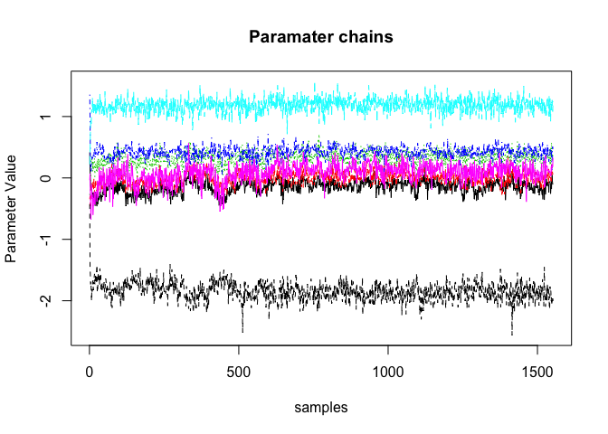
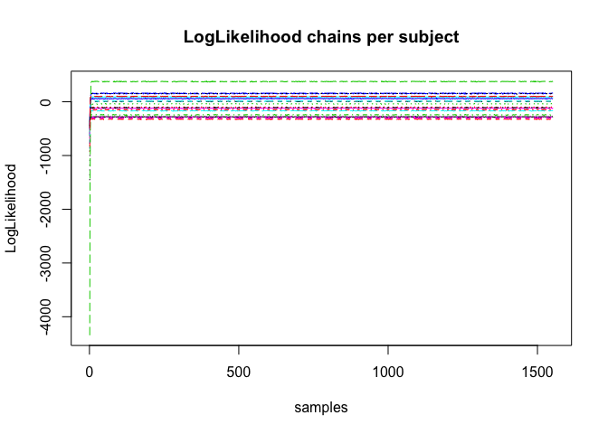
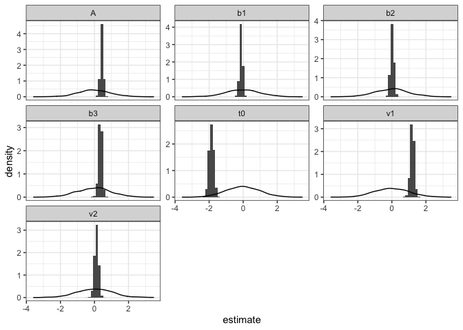
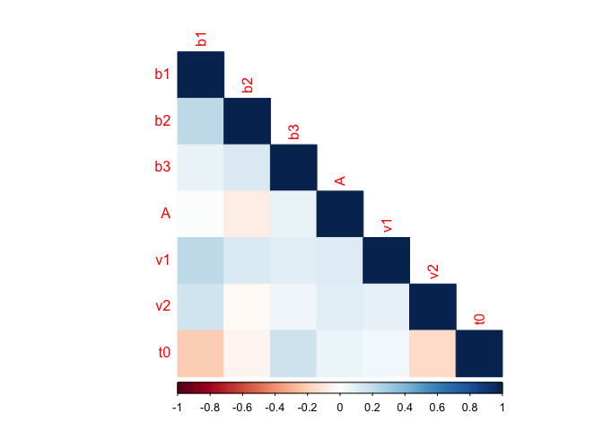
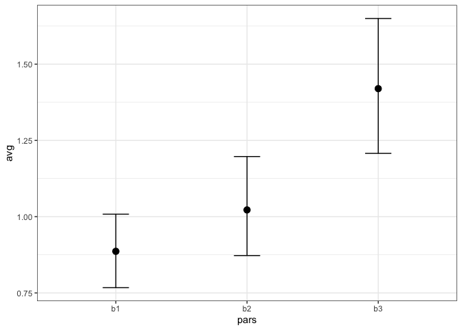

So you’ve made the PMwG sampler work and now you have a `sampled`
object, what’s next? Well now is where the fun stuff happens - checking,
inference, plots and posteriors. In this short blog post, I’ll show
several user contributed functions to make plots and output that is a
great starting step for analysing your posterior model estimates.

To start with, we’ll go through some checks to make sure the sampler has
run as we expected. Next, we’ll go through analysing posterior parameter
and random effects (and convariance) estimates. Finally, I’ll provide
code to create posterior predictive data so that you can compare the
model estimates to the real data.

## Checking

The first thing we should do with a PMwG object is check that it sampled
correctly. For this, there are two main plots I look at - the parameter
‘chains’ and the subject likelihood ‘chains’. These are shown in the
sampler documentation and are great ways to quickly visualise the
sampling process.

### Chain plots

From the parameter chains, we would expect to see stationarity of
parameters. By this I mean that the parameter chains are flat and not
trending up or down. If they are moving up or down, we may not have yet
reached the posterior. Further, the chains should be thin and not
filling all of the prior space. If they are quite wide, this could
indicate that the parameter is not informed. In the acceptance rates, if
this is happening, it is likely that you would see very high acceptance
as well. Often this happens when the likelihood isn’t specified
correctly (for example, those pesky factors being read in the wrong way)
and as a consequence, the likelihood returned on each step doesn’t
change. This will be evident in the chain plot.

Secondly, another good plot to look at is the subject likelihood plot.
In this plot, similar to the parameter chains, we are looking for
stationarity in the likelihood estimates for each subject (each line).
It is likely that the subject likelihood plot will rapidly jump from a
low value to a high one and remain in this region. If all estimates are
the same for all subjects, this can also indicate a problem in the
likelihood function, similar to the one above.

Shown below is code and example outputs for the chain plots.

``` r
pmwg_chainPlots <- function(samples, subjectParPlot = F, parameterPlot = T, subjectLLPlot = T){
  if (subjectParPlot){
    par(mfrow = c(2, ceiling(samples$n_pars/2)))
    for (par in samples$par_names){
      matplot(t(samples$samples$alpha[par,,]),type="l", main = par, xlab = "samples", ylab = "ParameterValue")
    } 
  }
  par(mfrow=c(1,1))
  if(parameterPlot) matplot(t(samples$samples$theta_mu), type="l", main = "Paramater chains", ylab = "Parameter Value", xlab = "samples")
  if(subjectLLPlot) matplot(t(samples$samples$subj_ll), type="l", main = "LogLikelihood chains per subject", ylab = "LogLikelihood", xlab = "samples")
  if(sum(subjectParPlot, parameterPlot, subjectLLPlot) > 1) print('plots presented behind eachother')
  
}

pmwg_chainPlots(sampled)
```

<!-- --><!-- -->

    ## [1] "plots presented behind eachother"

From these outputs we can see that the parameter plots show thin
stationary lines. Secondly, we can see the likelihood plots show a rapid
rise and then stationary, separated lines. These are indicative that
sampling worked as intended.

### Parameter histograms

Secondly, it’s important to look at the posterior density of parameter
estimates. To do this, I use a function that plots a historgram of each
parameter. Additionally, I overlay the prior density to see if our
priors were too restrictive or if we haven’t learnt anything new
(i.e. prior = posterior).

``` r
pmwg_parHist <- function(samples, bins =30, prior = FALSE ){
  if (!prior){
    chains <- as.array(as_mcmc(samples))
    mcmc_hist(chains)
  } else{
    theta <- t(sampled$samples$theta_mu)
    theta<-as.data.frame(theta)
    long <- sum(sampled$samples$stage=="sample")
    theta <- theta[c((length(theta[,1])-long+1):length(theta[,1])),]
    theta <- pivot_longer(theta, cols = everything(), names_to = "pars", values_to = "estimate" )
    prior_mean <- sampled$prior$theta_mu_mean
    prior_var <- diag(sampled$prior$theta_mu_var)
    priors = NULL
    for (i in 1:sampled$n_pars){
      tmp <- rnorm(n=long, mean=prior_mean[i], sd=prior_var[i])
      tmp <- as.data.frame(tmp)      
      priors<-  c(priors, tmp[1:long,])
    }
    priors<-as.data.frame(priors)
    y <- as.factor(sampled$par_names)
    theta<-theta[order(factor(theta$pars, levels = y)),]
    theta$prior <- priors$priors
    theta$pars<- as.factor(theta$pars)
    
    
    ggplot(theta, aes(estimate))+
      geom_histogram(aes(y =..density..), bins = bins)+
      geom_density(aes(prior))+
      facet_wrap(~pars, scales = "free_y")+
      theme_bw()
  }
}

pmwg_parHist(sampled, bins=50, prior =T)
```

<!-- -->

In this example, we can see that for t0, the prior may be too
restrictive, however, for other estimates, all seems as expected, with
posterior samples falling in a thin range.

## Posterior Estimates

Now we know the sampler worked as intended, we can look at the posterior
parameter estimates. For this part, it is crucial to remember the
parameter transformations. For example, in the LBA, all input parameters
must be positive, so we take the exponent of the proposed values on each
iteration in the likelihood function. This means that when we interpret
posterior parameters, we should also take the exponent of the value. For
example, t0 in the example above is centered around -2 – an impossible
value– and so we should take the exponent of it (0.135) as this is what
the model is actually using.

### Parameter histograms

From the previous section, we can also use this plot to see where the
posterior parameters lie. As mentioned above, we need to take the
exponent of these LBA values, so this time I’ll include the
transformations in the function.

``` r
pmwg_parHist <- function(samples, bins =30, prior = FALSE ){
  if (!prior){
    chains <- as.array(as_mcmc(samples))
    mcmc_hist(chains)
  } else{
    theta <- exp(t(sampled$samples$theta_mu)) ### exp here
    theta<-as.data.frame(theta)
    long <- sum(sampled$samples$stage=="sample")
    theta <- theta[c((length(theta[,1])-long+1):length(theta[,1])),]
    theta <- pivot_longer(theta, cols = everything(), names_to = "pars", values_to = "estimate" )
    prior_mean <- exp(sampled$prior$theta_mu_mean) ## exp here
    prior_var <- exp(diag(sampled$prior$theta_mu_var)) ## exp here
    priors = NULL
    for (i in 1:sampled$n_pars){
      tmp <- rnorm(n=long, mean=prior_mean[i], sd=prior_var[i])
      tmp <- as.data.frame(tmp)      
      priors<-  c(priors, tmp[1:long,])
    }
    priors<-as.data.frame(priors)
    y <- as.factor(sampled$par_names)
    theta<-theta[order(factor(theta$pars, levels = y)),]
    theta$prior <- priors$priors
    theta$pars<- as.factor(theta$pars)
    
    
    ggplot(theta, aes(estimate))+
      geom_histogram(aes(y =..density..), bins = bins)+
      geom_density(aes(prior))+
      facet_wrap(~pars, scales = "free_y")+
      theme_bw()
  }
}

pmwg_parHist(sampled, bins=50, prior =T)
```

<!-- -->

Here, we can see that t0 is just above 0, v1 is greater than v2 (correct
\> error drift rates) and there are three separable threshold values.

### Output tables

Whilst the above plot is useful, we may wish to get some more fine
grained analysis. For this, again looking at the group level (theta)
values, we can create some output tables.

First we look at mean parameter estimates (and variance using 95%
credible intervals)

``` r
qL=function(x) quantile(x,prob=.05,na.rm = TRUE) #for high and low quantiles
qH=function(x) quantile(x,prob=.95,na.rm = TRUE)

tmp <- exp(apply(sampled$samples$theta_mu[,sampled$samples$stage=="sample"],1,mean))
lower <- exp(apply(sampled$samples$theta_mu[,sampled$samples$stage=="sample"],1,qL))
upper <- exp(apply(sampled$samples$theta_mu[,sampled$samples$stage=="sample"],1,qH))
tmp <- t(rbind(tmp,lower,upper))
kable(tmp)
```

|    |       tmp |     lower |     upper |
| -- | --------: | --------: | --------: |
| b1 | 0.8832800 | 0.7672251 | 1.0082430 |
| b2 | 1.0173988 | 0.8724713 | 1.1971625 |
| b3 | 1.4128471 | 1.2075098 | 1.6497759 |
| A  | 1.5383791 | 1.3499831 | 1.7429653 |
| v1 | 3.3117580 | 2.7409280 | 3.9455836 |
| v2 | 1.1322673 | 0.9322809 | 1.3405226 |
| t0 | 0.1540344 | 0.1243581 | 0.1915416 |

This is a nice way to view the posterior parameter means and ranges.
Next, we can look at the mean covariance structure, which we will
transform into a correlation matrix.

``` r
cov<-apply(sampled$samples$theta_sig[,,sampled$samples$idx-1000:sampled$samples$idx] ,1:2, mean)
colnames(cov)<-pars
rownames(cov)<-pars
cor<-cov2cor(cov) #transforms covariance to correlation matrix
kable(cor)
```

|    |          b1 |          b2 |        b3 |           A |        v1 |          v2 |          t0 |
| -- | ----------: | ----------: | --------: | ----------: | --------: | ----------: | ----------: |
| b1 |   1.0000000 |   0.2261599 | 0.0722276 |   0.0124526 | 0.2234376 |   0.1664706 | \-0.2142574 |
| b2 |   0.2261599 |   1.0000000 | 0.1250495 | \-0.0768053 | 0.1306218 | \-0.0276819 | \-0.0462468 |
| b3 |   0.0722276 |   0.1250495 | 1.0000000 |   0.0710326 | 0.1006157 |   0.0548435 |   0.1736373 |
| A  |   0.0124526 | \-0.0768053 | 0.0710326 |   1.0000000 | 0.1164379 |   0.1028593 |   0.0674493 |
| v1 |   0.2234376 |   0.1306218 | 0.1006157 |   0.1164379 | 1.0000000 |   0.0823956 |   0.0483617 |
| v2 |   0.1664706 | \-0.0276819 | 0.0548435 |   0.1028593 | 0.0823956 |   1.0000000 | \-0.1596716 |
| t0 | \-0.2142574 | \-0.0462468 | 0.1736373 |   0.0674493 | 0.0483617 | \-0.1596716 |   1.0000000 |

This is a good first summary, but now lets plot this with corrplot.

``` r
corrplot(cor, method="color", type = "lower")
```

<!-- -->

This covariance analysis looks at the correlations between parameter
values. Here we can see that b1 and v1 are positively correlated,
whereas t0 and b1 are negatively correlated. PMwG is great at dealing
with models with high autocorrelation of parameters, and so it is
important to check these kinds of outputs to see where correlations
exist in the model and what could underpin these (or whether these
should NOT be correlated).

### Inference

Importantly for psych research, we might wish to do inference on the
parameter estimates. Here, we can use any kind of classic inference test
to look for differences between parameter values. We can also test this
by looking at whether the difference between posterior parameter
estimates crosses zero.

First though, lets look to see if there’s a difference between the b
parameters using a bayesian anova.

``` r
library(BayesFactor)
tmp <- as.data.frame(apply(sampled$samples$theta_mu[,sampled$samples$stage=="sample"],1,exp))

tmp <- tmp[,c(1:3)]
tmp <- tmp %>% pivot_longer(everything() , names_to = "pars", values_to = "estimate")
tmp <- as.data.frame(tmp)
tmp$pars<-as.factor(tmp$pars)

anovaBF(estimate ~ pars, data=tmp)
```

    ##   |                                                                                                                                                               |                                                                                                                                                       |   0%  |                                                                                                                                                               |=======================================================================================================================================================| 100%

    ## Bayes factor analysis
    ## --------------
    ## [1] pars : 7.809663e+1090 ±0%
    ## 
    ## Against denominator:
    ##   Intercept only 
    ## ---
    ## Bayes factor type: BFlinearModel, JZS

From this output, there is strong evidence for a difference between
these conditions. Next we can plot these estimates to see the difference
between b values visually.

``` r
plot.data <- tmp %>% group_by(pars) %>% summarise(avg = mean(estimate),
                                                  lower = qL(estimate),
                                                  upper = qH(estimate)) %>% ungroup()


ggplot(plot.data, aes(x=pars, y=avg)) + 
  geom_point(size=3) +
  geom_errorbar(aes(ymin=lower,ymax=upper),width=0.2) +
  theme_bw()
```

<!-- -->

Another method we can use to look for a difference between parameters is
to check if the difference between posterior parameters crosses 0. If it
does not, then one posterior estimate is reliably greater than the
other. Lets check this for b1 and b2. Here, we can set a frequentist
style criterion (lets say 95%), and if 95% of the difference between
samples are on one side of zero, we can conclude that there is a
difference between these parameters. Alternatively, we could run a
separate model where these parameters were not separated and then do
model comparison methods for these models.

``` r
tmp <- as.data.frame(apply(sampled$samples$theta_mu[,sampled$samples$stage=="sample"],1,exp))

tmp <- tmp[,c(1:2)]
tmp$diff <- tmp$b1-tmp$b2
mean(tmp$diff>0)
```

    ## [1] 0.062

Here we can see that 93.8% of the samples are greater than zero, so
there is not conclusive evidence that these parameters vary at the group
level.

## Posterior Predictive Data

Finally, an important part of post-model processing is generating
posterior predictive data. Using this generated data, we can check to
see if the posterior data ‘fits’ the data. To generate posterior
predictive data, we first need to randomly sample some individual random
effects. We then use these in the log-likelihood function (using
`sample=TRUE`) to generate data. For this part, it is important that
your likelihood function is set up correctly to generate data. However,
if this is not the case, you can restructure your likelihood function
and change the function below so that it still operates correctly.

``` r
pmwg_generatePosterior <- function(sampled, n){
  n.posterior=n # Number of parameter samples from posterior distribution.
  pp.data=list()
  S = sampled$n_subjects
  data=sampled$data
  sampled_stage = length(sampled$samples$stage[sampled$samples$stage=="sample"])
  for (s in 1:S) {
    cat(s," ")
    iterations=round(seq(from=(sampled$samples$idx-sampled_stage) , to=sampled$samples$idx, length.out=n.posterior))
    for (i in 1:length(iterations)) {
      x <- sampled$samples$alpha[,s,iterations[i]]
      names(x) <- sampled$par_names
      tmp=sampled$ll_func(x=x,data=data[as.integer(as.numeric(data$subject))==s,],sample=TRUE) ##change here to your own sampled function if your likelihood was not set up correctly
      if (i==1) {
        pp.data[[s]]=cbind(i,tmp)
      } else {
        pp.data[[s]]=rbind(pp.data[[s]],cbind(i,tmp))
      }
    }
  }
  return(pp.data)
}

pp.data<-generate.posterior(sampled,20) #i do 20 because that seems fine
tmp=do.call(rbind,pp.data) #binds together
```

    ##   i subject        rt resp condition
    ## 1 1       1 0.8109699    1         1
    ## 2 1       1 1.3727252    1         2
    ## 3 1       1 1.0959211    2         3
    ## 4 1       1 0.4747878    1         1
    ## 5 1       1 0.9924096    1         2
    ## 6 1       1 2.8030712    1         3

Here you can see that I’ve generated 20 samples for each person. The
column `i` shows the iteration. This does take a little bit of time, but
not too long (it depends on your likelihood). When writing your
likelihood, we often try and make this step as safe as possible (rather
than fast) as it is only called several times.

Now we have posterior predictive data, we can plot this against the real
data.

``` r
summ <- tmp %>% group_by(i,condition) %>%
  summarise(MeanRT = mean(rt,na.rm=TRUE),
            ACC = mean(resp),
            qL = qL(rt),
            qH = qH(rt),
            qLA = qL(resp),
            qHA = qH(resp))%>%
  ungroup()
```

    ## `summarise()` regrouping output by 'i' (override with `.groups` argument)

``` r
summ$source <- "model"
summD <- data %>% group_by(condition) %>%
  summarise(MeanRT = mean(rt,na.rm=TRUE),
            ACC = mean(resp),
            qL = qL(rt),
            qH = qH(rt),
            qLA = qL(resp),
            qHA = qH(resp))%>%
  ungroup()
```

    ## `summarise()` ungrouping output (override with `.groups` argument)

``` r
summD$source <- "data"

ggplot(summ, aes(x=condition, y=ACC, color=source, group=source))+geom_point()+geom_col(data=summD, aes(x=condition, y=ACC), alpha=0.2)+theme_bw() 
```

<!-- -->

``` r
ggplot(summ, aes(x=condition, y=MeanRT, color=source, group=source))+geom_point()+geom_col(data=summD, aes(x=condition, y=MeanRT), alpha=0.2)+theme_bw() 
```

<!-- -->

In these plots, I simply show the mean rt and accuracy for both the data
(bars) and each posterior predictive iteration (20 dots). There are a
variety of alternative methods to showing the descriptive adequacy of
the model, such as Q-Q plots and plots across subjects, however, this is
a quick way to check the fit of the model and a stepping stone to better
analysis and graphs.

## Model Comparison

Finally, an important part of post modelling is often model comparison.
There are many methods of model comparison, and they all have advantages
and disadvantages - which I’m not going to go into. Here, I show two
methods of model comparison - DIC and IS2. If you have the time and
computer resources, we recommend using IS2 with PMwG objects. This comes
from the paper by Minh-Ngoc Tran and colleagues for [robustly estimating
the marginal likelihood by importance
sampling](https://link.springer.com/article/10.3758/s13428-020-01348-w).
An important caveat of this method however, is that it relies heavily on
the settings of the prior (which are input *before* sampling). If the
prior is too restrictive, too broad or just wrong, then estimates will
be biased. This means that more complex models will be more penalized
when the prior is set incorrectly (or uninformed), and why it is crucial
to check the posterior parameter estimates (with functions like that
above - e.g. pmwg\_ParHist) before doing this kind of model comparison.

### DIC

DIC is a commonly used information criteria for comparing models. The
function below takes in a sampled pmwg object and returns the DIC value.

``` r
pmwg_DIC=function(sampled,pD=FALSE){
  nsubj=length(unique(sampled$data$subject))
  
  # the mean likelihood of the overall (sampled-stage) model, separately for each subject
  mean.like <- apply(sampled$samples$subj_ll[,sampled$samples$stage=="sample"],1,mean)
  
  # the mean of each parameter across iterations. Keep dimensions for parameters and subjects
  mean.params <- t(apply(sampled$samples$alpha[,,sampled$samples$stage=="sample"],1:2,mean))
  
  # i name mean.params here so it can be used by the log_like function
  colnames(mean.params)<-sampled$par_names
  
  # log-likelihood for each subject using their mean parameter vector
  mean.params.like <- numeric(ncol(mean.params))
  data <- transform(sampled$data, subject=match(subject, unique(subject)))
  for (j in 1:nsubj) {
    mean.params.like[j] <- sampled$ll_func(mean.params[j,], data=data[data$subject==j,], sample=FALSE)
  }
  
  # Effective number of parameters
  pD <- sum(-2*mean.like + 2*mean.params.like)
  
  # Deviance Information Criterion
  DIC <- sum(-4*mean.like + 2*mean.params.like)
  
  if (pD){
    return(c("DIC"=DIC,"effective parameters"=pD))
  }else{
    return(DIC)
  }
  
}

pmwg_DIC(sampled)
```

    ##                  DIC effective parameters 
    ##             2135.809              124.878

A DIC value on it’s own is relatively meaningless unless compared
against competing models, so we could fit another model where threshold
did not vary between condition 1 and condition 2 and then check which of
the models had the lower DIC.

### IS2

Importance sampling squared is another method of model comparison. IS2
allows for robust and unbiased estimation of the marginal likelihood.
The script below will run IS2 on a sampled object once loaded in,
however, it can take some time. Typically, we generate around 10,000 IS
samples, with 250 particles. The IS2 method works by first generating an
importance distribution for the fixed parameters. This importance
distribution is constructed by fitting a mixture of normal or Student t
distributions to these MCMC samples. We then construct conditional
proposal parameters - called particles - for each subject. The marginal
likelihood is then estimated unbiasedly which is combined with the
importance distribution. From this method, the importance sampling
procedure is in itself an importance sampling procedure which can be
used to estimate the likelihood.

IS2 Script;

``` r fold-hide
#######       IS2 t-distribution Code       #########

## set up environment and packages 
rm(list=ls())
library(mvtnorm)
library(MCMCpack)
library(rtdists)
library(invgamma)
library(mixtools)
library(condMVNorm)
library(parallel)
load("sampled.Rdata")

cpus = 20
###### set up variables #####
# number of particles, samples, subjects, random effects etc
n_randeffect=sampled$n_pars
n_subjects = sampled$n_subjects
n_iter = length(sampled$samples$stage[sampled$samples$stage=="sample"])
length_draws = sampled$samples$idx #length of the full transformed random effect vector and/or parameter vector
IS_samples = 10000 #number of importance samples
n_particles = 250 #number of particles
v_alpha = 2  #?
pars = sampled$pars


# grab the sampled stage of PMwG
# store the random effects
alpha <- sampled$samples$alpha[,,sampled$samples$stage=="sample"]
# store the mu
theta <- sampled$samples$theta_mu[,sampled$samples$stage=="sample"]
# store the cholesky transformed sigma
sig <- sampled$samples$theta_sig[,,sampled$samples$stage=="sample"]
# the a-hlaf is used in  calculating the Huang and Wand (2013) prior. 
# The a is a random sample from inv gamma which weights the inv wishart. The mix of inverse wisharts is the prior on the correlation matrix
a_half <- log(sampled$samples$a_half[,sampled$samples$stage=="sample"])


unwind=function(x,reverse=FALSE) {

  if (reverse) {
    ##        if ((n*n+n)!=2*length(x)) stop("Wrong sizes in unwind.")
    n=sqrt(2*length(x)+0.25)-0.5 ## Dim of matrix.
    out=array(0,dim=c(n,n))
    out[lower.tri(out,diag=TRUE)]=x
    diag(out)=exp(diag(out))
    out=out%*%t(out)
  } else {
    y=t(chol(x))
    diag(y)=log(diag(y))
    out=y[lower.tri(y,diag=TRUE)]
  }
  return(out)
}

robust_diwish = function (W, v, S) 
{
  if (!is.matrix(S)) 
    S <- matrix(S)
  if (nrow(S) != ncol(S)) {
    stop("S not square in diwish().\n")
  }
  if (!is.matrix(W)) 
    W <- matrix(W)
  if (nrow(W) != ncol(W)) {
    stop("W not square in diwish().\n")
  }
  if (nrow(S) != ncol(W)) {
    stop("W and X of different dimensionality in diwish().\n")
  }
  if (v < nrow(S)) {
    stop("v is less than the dimension of S in  diwish().\n")
  }
  p <- nrow(S)
  gammapart <- sum(lgamma((v + 1 - 1:p)/2))
  ldenom <- gammapart + 0.5 * v * p * log(2) + 0.25 * p * (p - 
                                                             1) * log(pi)
  cholS <- chol(S)
  #cholW <- chol(W)
  
  
  cholW <- tryCatch(chol(W),error= return(1e-10))   
  halflogdetS <- sum(log(diag(cholS)))
  halflogdetW <- sum(log(diag(cholW)))
  invW <- chol2inv(cholW)
  exptrace <- sum(S * invW)
  lnum <- v * halflogdetS - (v + p + 1) * halflogdetW - 0.5 * 
    exptrace
  lpdf <- lnum - ldenom
  return(exp(lpdf))
}


#unwound sigma
pts2.unwound = apply(sig,3,unwind)

n.params<- nrow(pts2.unwound)+n_randeffect+n_randeffect
all_samples=array(dim=c(n_subjects,n.params,n_iter))
mu_tilde=array(dim = c(n_subjects,n.params))
sigma_tilde=array(dim = c(n_subjects,n.params,n.params))


for (j in 1:n_subjects){
  all_samples[j,,] = rbind(alpha[,j,],theta[,],pts2.unwound[,])
  # calculate the mean for re, mu and sigma
  mu_tilde[j,] =apply(all_samples[j,,],1,mean)
  # calculate the covariance matrix for random effects, mu and sigma
  sigma_tilde[j,,] = cov(t(all_samples[j,,]))
}


X <- cbind(t(theta),t(pts2.unwound),t(a_half)) 

muX<-apply(X,2,mean)
sigmaX<-var(X)

# generates the IS proposals
prop_theta=mvtnorm::rmvt(IS_samples,sigma = sigmaX, df=1, delta=muX)
#prop_theta_compare=rmvnorm(IS_samples,muX,sigmaX)


### main functions

group_dist = function(random_effect = NULL, parameters, sample = FALSE, n_samples = NULL, n_randeffect){
  param.theta.mu <- parameters[1:n_randeffect]
  param.theta.sig.unwound <- parameters[(n_randeffect+1):(length(parameters)-n_randeffect)] 
  param.theta.sig2 <- unwind(param.theta.sig.unwound, reverse = TRUE)
  if (sample){
    return(mvtnorm::rmvnorm(n=n_samples, mean=param.theta.mu,sigma=param.theta.sig2))
  }else{
    logw_second<-mvtnorm::dmvnorm(random_effect, param.theta.mu,param.theta.sig2,log=TRUE)
    return(logw_second)
  }
}


prior_dist = function(parameters, prior_parameters = sampled$prior, n_randeffect){ ###mod notes: the sampled$prior needs to be fixed/passed in some other time
  param.theta.mu <- parameters[1:n_randeffect]
  param.theta.sig.unwound <- parameters[(n_randeffect+1):(length(parameters)-n_randeffect)] ##scott would like it to ask for n(unwind)
  param.theta.sig2 <- unwind(param.theta.sig.unwound, reverse = TRUE)
  param.a <- exp(parameters[((length(parameters)-n_randeffect)+1):(length(parameters))])
  v_alpha=2
  
  log_prior_mu=mvtnorm::dmvnorm(param.theta.mu, mean = prior_parameters$theta_mu_mean, sigma = prior_parameters$theta_mu_var, log =TRUE)
  
  log_prior_sigma = log(robust_diwish(param.theta.sig2, v=v_alpha+ n_randeffect-1, S = 2*v_alpha*diag(1/param.a)))  #exp of a-half -> positive only
  log_prior_a = sum(invgamma::dinvgamma(param.a,scale = 0.5,shape=1,log=TRUE))
  
  logw_den2 <- sum(log(1/param.a)) # jacobian determinant of transformation of log of the a-half
  logw_den3 <- log(2^n_randeffect)+sum((n_randeffect:1+1)*log(diag(param.theta.sig2))) #jacobian determinant of cholesky factors of cov matrix
  
  return(log_prior_mu + log_prior_sigma + log_prior_a + logw_den3 - logw_den2)
}


get_logp=function(prop_theta,data,n_subjects,n_particles,n_randeffect,mu_tilde,sigma_tilde,i, group_dist=group_dist){
  #make an array for the density
  logp=array(dim=c(n_particles,n_subjects))
  # for each subject, get 1000 IS samples (particles) and find log weight of each
  for (j in 1:n_subjects){
    #generate the particles from the conditional MVnorm AND mix of group level proposals
    wmix <- 0.95
    n1=rbinom(n=1,size=n_particles,prob=wmix)
    if (n1<2) n1=2
    if (n1>(n_particles-2)) n1=n_particles-2 ## These just avoid degenerate arrays.
    n2=n_particles-n1
    # do conditional MVnorm based on the proposal distribution
    conditional = condMVNorm::condMVN(mean=mu_tilde[j,],sigma=sigma_tilde[j,,],dependent.ind=1:n_randeffect,
                          given.ind=(n_randeffect+1):n.params,X.given=prop_theta[i,1:(n.params-n_randeffect)])
    particles1 <- mvtnorm::rmvnorm(n1, conditional$condMean,conditional$condVar)
    # mix of proposal params and conditional
    particles2 <- group_dist(n_samples=n2, parameters = prop_theta[i,],sample=TRUE, n_randeffect=n_randeffect)
    particles <- rbind(particles1,particles2)
    
    for (k in 1:n_particles){
      x <-particles[k,]
      #names for ll function to work
      #mod notes: this is the bit the prior effects
      names(x)<-sampled$par_names
      #   do lba log likelihood with given parameters for each subject, gets density of particle from ll func
      logw_first=sampled$ll_func(x,data = data[as.numeric(factor(data$subject))==j,]) #mod notes: do we pass this in or the whole sampled object????
      # below gets second part of equation 5 numerator ie density under prop_theta
      # particle k and big vector of things
      logw_second<-group_dist(random_effect = particles[k,], parameters = prop_theta[i,], sample= FALSE, n_randeffect = n_randeffect) #mod notes: group dist
      # below is the denominator - ie mix of density under conditional and density under pro_theta
      logw_third <- log(wmix*dmvnorm(particles[k,], conditional$condMean,conditional$condVar)+(1-wmix)*exp(logw_second)) #mod notes: fine?
      #does equation 5
      logw=(logw_first+logw_second)-logw_third
      #assign to correct row/column
      logp[k,j]=logw 
    }
  }
  #we use this part to centre the logw before addign back on at the end. This avoids inf and -inf values
  sub_max = apply(logp,2,max)
  logw = t(t(logp) - sub_max)
  w = exp(logw)
  subj_logp = log(apply(w,2,mean))+sub_max #means
  
# sum the logp and return
  if(is.nan(sum(subj_logp))){
    return(1e-10)
  }else{
  return(sum(subj_logp))
  }
}

compute_lw=function(prop_theta,data,n_subjects,n_particles,n_randeffect,mu_tilde,sigma_tilde,i, prior_dist=prior_dist, sampled=sampled){
  
  logp.out <- get_logp(prop_theta,data,n_subjects,n_particles,n_randeffect,mu_tilde,sigma_tilde,i, group_dist=group_dist)
  ##do equation 10
  logw_num <- logp.out[1]+prior_dist(parameters = prop_theta[i,], prior_parameters = sampled$prior, n_randeffect)
  logw_den <- mvtnorm::dmvt(prop_theta[i,], delta=muX, sigma=sigmaX,df=1, log = TRUE) #density of proposed params under the means
  logw     <- logw_num-logw_den #this is the equation 10
  return(c(logw))
  #NOTE: we should leave a note if variance is shit - variance is given by the logp function (currently commented out)
}


##### make it work

#makes an array to store the IS samples
tmp<-array(dim=c(IS_samples))

#do the sampling
if (cpus>1){
  tmp <- mclapply(X=1:IS_samples,mc.cores = cpus, FUN = compute_lw, prop_theta = prop_theta,data = data,n_subjects= n_subjects,n_particles = n_particles,
                  n_randeffect = n_randeffect,mu_tilde=mu_tilde,sigma_tilde = sigma_tilde, prior_dist=prior_dist, sampled=sampled)
} else{
  for (i in 1:IS_samples){
    cat(i)
    tmp[i]<-compute_lw(prop_theta,data,n_subjects,n_particles, n_randeffect,mu_tilde,sigma_tilde,i,prior_dist=prior_dist, sampled=sampled)
  }
}


# get the ML value
finished <- tmp
tmp<-unlist(tmp)
max.lw <- max(tmp)
mean.centred.lw <- mean(exp(tmp-max.lw)) #takes off the max and gets mean (avoids infs)
MLE <-log(mean.centred.lw)+max.lw #puts max back on to get the lw
```

This script returns the maximum likelihood estimate for a model. Similar
to DIC, this is relatively meaningless without something to compare to,
where the model with the higher MLE is chosen. Further, we can also
compute Bayes factors with MLE’s to show the weight of evidence for one
model over another.

## Conclusions

Ultimately, post sampling analysis is up to the user, but hopefully this
blog has provided some insight into what sort of analysis is typically
done, some ways of checking the sampling process, methods of posterior
analysis and generating posterior data, as well as some model comparison
insights. For more info on the PMwG sampler, see the
[documentation](https://newcastlecl.github.io/samplerDoc/) and for some
more useful functions, see the [PMwG toolkit
github](https://github.com/NewcastleCL/pmwg_toolkit).

### References

Tran, M. N., Scharth, M., Gunawan, D., Kohn, R., Brown, S. D., &
Hawkins, G. E. (2020). Robustly estimating the marginal likelihood for
cognitive models via importance sampling. *Behavior Research Methods*,
1-18.
