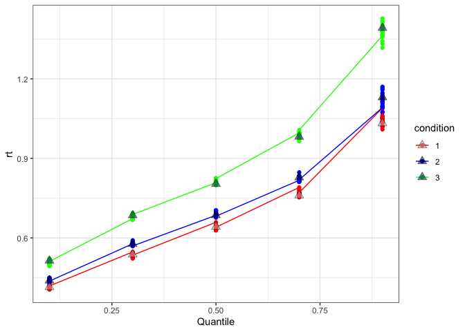

This blog post presents a brief guide on how to create synthetic data,
and perform parameter recovery, using the PMwG sampler. Parameter
recovery is highly important in cognitive modelling procedures as it
provides an indication of parameter identifiability (and in a way, model
“power”). Parameter recovery involves creating synthetic data using a
likelihood function, checking the synthetic data, performing a sampling
regime and then checking the posterior estimates (as well as posterior
predictive data). It is an essential step in the modelling process.

Parameter recovery through simulation allows us to be confident in our
models for three reasons. First, it gives us confidence that our model
*actually works*, i.e. it runs, it relates to data, it does what it’s
supposed to do. Secondly, parameter recovery allows us to see whether
the parameter values we input are recovered at the end, and this can
give us confidence in the reliability of our model. Finally, parameter
recovery allows us to test a variety of parameter combinations and
models, which can test theory and help us build hypotheses.

## Synthetic data

Synthetic data is data generated from your model. When simulating this
synthetic data, we make a data set that looks just like real data
(i.e. same structure), with the aim of later replacing it with real
data. We also want this synthetic data to reflect real data -
i.e. somewhere in the ballpark of means and variance. When generating
synthetic data, we input parameter values that we decide (or could be
informed by prior research) and then use a random generator function
(like rnorm, rlba or rddm), that takes in these values to create data.

By creating synthetic data, we are able to control the input parameters,
and so we are able to better understand how parameters affect synthetic
data - i.e. whether changing given parameters changes output. Secondly,
we are able to see if the original values are recovered following
sampling, therefore showing how well the model identifies the actual
effects. Finally, we can see how well the posterior predictive data fits
the synthetic data. Often different parameters may lead to similar
patterns in the data (i.e. higher thresholds and higher t0 can show
similar increases in rt for accumulator models), so by comparing to the
posterior predictive, this can give us an indication of whether our
model can tease apart parameter differences.

Within PMwG, there is an assumed hierarchical structure, with group
level (theta) and individual participant level (alpha) values. On each
iteration of the sampling process, n particles density are compared
(given the data). These particles are drawn from a multivariate normal
distribution centered around each participants current particle (with
added noise). To create this multivariate normal distribution, the
sampler also uses a covariance matrix, which gives insight into the
level of covariance between individual parameters. This makes simulating
synthetic data for the PMwG sampler slightly more complex, as simulated
parameters should also have a covariance structure constraining them.
This is shown below.

In this blog post I will;

  - construct the data structure
  - construct a likelihood function with sampling and density
    calculation arguments.
  - create some parameters for the model
  - fill in the values for these parameters
  - constrain by the covariance matrix
  - create data
  - perform parameter recovery.

## Simulation

#### Starting out

First I load in the packages used for this exercise;

``` r
library(rtdists)
library(mvtnorm) ## For the multivariate normal.
library(MASS) ## For matrix inverse.
library(MCMCpack)
library(lme4)
library(dplyr)
library(ggplot2)
library(tidyr)
```

#### Data structure

Next, we set up the structure of the data frame to be filled with data.
For this exercise, i use 3 conditions, each with 100 trials for 20
participants. You can create whatever data structure you wish, however,
it should map to your likelihood function, should be the same as your
real data (or at least the parts of your real data used in the
likelihood function) and can be any length (but more is better). I do
this setup step first as this often assists with writing the likelihood
function (i.e. for correct column names and data structure).

``` r
n.trials = 100      #number trials per subject per conditions
n.subj = 20         #number of subjects
n.cond = 3          #number of conditions


names=c("subject","rt","resp","condition") #names of columns
data = data.frame(matrix(NA, ncol = length(names), nrow = (n.trials*n.subj*n.cond))) #empty data frame
names(data)=names
data$condition = rep(1:n.cond,times = n.trials) #filling in condition
data$subject = rep(1:n.subj, each = n.trials*n.cond) #filling in subjects
```

#### Construct the model

Now that the data structure has been created, I need to establish my
model. The model I use here is similar to that used in
[Chapter 3](https://newcastlecl.github.io/samplerDoc/forstmannChapter.html#writellFunc)
of the PMwG Documention. This model is a LBA model which includes 3
different thresholds (differing across conditions).

``` r
log_likelihood=function(x,data,sample=TRUE) {
  x=exp(x)
  bs=x["A"]+x[c("b1","b2","b3")][data$condition]
  if (sample) { #for sampling
    out=rLBA(n=nrow(data),A=x["A"],b=bs,t0=x["t0"],mean_v=x[c("v1","v2")],sd_v=c(1,1),distribution="norm",silent=TRUE)
  } else { #for calculating density
    out=dLBA(rt=data$rt,response=data$correct,A=x["A"],b=bs,t0=x["t0"],mean_v=x[c("v1","v2")],sd_v=c(1,1),distribution="norm",silent=TRUE)
    bad=(out<1e-10)|(!is.finite(out))
    out[bad]=1e-10
    out=sum(log(out))
  }
  out
}
```

In this example, I use responses “1” and “2”, but you can use whatever
responses you would prefer (i.e. correct or error etc). Further, you
could also use a different model type (i.e. diffusion).

#### Create model parameters

Next, I create my parameter vector;

``` r
parameter.names=c("b1","b2","b3", "A","v1","v2","t0")
n.parameters=length(parameter.names)
```

Now i set up a vector of parameter values and a matrix of covariance
matrix values. I label these `ptm` and `ptm2`;

``` r
ptm <- array(dim = n.parameters, dimnames = list(parameter.names)) #an empty array where i will put parameter values
pts2 <- array(dim=c(n.parameters,n.parameters), dimnames = list(parameter.names,parameter.names)) #an empty array where i will put the covariance matrix
```

#### Fill in model parameters

I then give start points for my input parameters. Here, I use increments
of 0.2 for the threshold parameters. It is important to consider a
number of different values to see if, and how, they affect the simulated
data (but you can do this later). For example, I may also want to vary
t0 or drift rates (i.e. different models) to see if these parameters are
also recoverable.

NOTE: these values are on the log scale (as the likelihood function
takes the exponent of these). This is important to note as PMwG draws
values along the real number line.

``` r
ptm[1:n.parameters]=c(0.1,0.3,0.5,0.4,1.2,0.3,-2) 
exp(ptm)
```

    ##        b1        b2        b3         A        v1        v2        t0 
    ## 1.1051709 1.3498588 1.6487213 1.4918247 3.3201169 1.3498588 0.1353353

#### Create covariance matrix

Next, I make the variance of the parameters. I do this in a simple way
by taking the absolute value for each parameter and divide by 10 - but
you can vary them however you like, for example, there may be
covariances that are important to the model. In this example with the
LBA, it might be better to put larger correlations between b and t0.

In this code, SigmaC is a matrix with diagonal of 0.2 (i.e. a
correlation of .2 between all parameters), and off diagonal as the
variance we just created. I then do sdcor2cov to create a covariance
matrix. I do this because, rather than correlation, PMwG expects
covariance. You can do the opposite transform to recover these
correlations after recovery.

This step is the tricky part of simulating in PMwG, as we need this
correlation structure (which becomes a covariance structure) to
constrain parameters.

``` r
vars = abs(ptm)/10 #off diagonal correlations are done as absolute/10
sigmaC = matrix(.2,nrow=length(ptm),ncol=length(ptm)) ###std dev correlation on diagonal - you might think this should be corr = 1, but it's actually the standard deviation 
diag(sigmaC)=sqrt(vars)
sigmaC <- sdcor2cov(sigmaC)
```

#### Create random effects

Finally, I create the subjects random effects. This is a n\_parameters
\* n\_subject matrix, so that each subject has a value for each
parameter. This is created using rmvnorm, where I do n\_subjects of
random samples using the mean parameters (ptm) and covariance matrix
(sigmaC). **These are the values we wish to recover using the model**
(so it’s often good to save out ptm, sigmaC and subj\_random\_effects).

``` r
subj_random_effects <- t(mvtnorm::rmvnorm(n.subj,mean=ptm,sigma=sigmaC))
```

    ##           [,1]        [,2]        [,3]         [,4]        [,5]        [,6]       [,7]       [,8]        [,9]      [,10]      [,11]      [,12]
    ## b1  0.06754572  0.16595634 -0.14890327  0.007714805  0.22501307  0.04926983  0.1242662  0.1685503  0.02285856  0.1965128  0.1384761 -0.1783804
    ## b2  0.45809512  0.01340640  0.08264425  0.460439178  0.30218297  0.23504860  0.2630983  0.1563505  0.32340648  0.1680148  0.4791735  0.2025268
    ## b3  0.58720469  0.37898141  1.13992801  0.573482556  0.32560658  0.63982060  0.6912657  0.7539752  0.21982543  0.5844972  0.5919369  0.4334701
    ## A   0.04662982  0.47198462  0.30647877  0.399114046  0.37684673  0.36270810  0.2050011  0.5426899  0.13960102  0.4180867  0.4450346  0.2092065
    ## v1  0.81182229  0.72201092  1.25883303  1.574770678  1.08952060  1.14255482  1.3145116  1.2392363  0.81793618  1.5938252  1.4879329  0.7255356
    ## v2  0.20903875  0.03129003  0.33744775  0.210704343  0.05004988  0.27938543  0.5693084  0.4971342  0.32438670  0.3977475  0.3670363  0.1248367
    ## t0 -1.75064334 -2.78634793 -1.26680060 -1.729459232 -2.60528073 -1.86775101 -3.1241916 -2.1788509 -2.25873295 -1.3214511 -1.8642588 -2.7759320
    ##         [,13]        [,14]      [,15]       [,16]       [,17]       [,18]      [,19]       [,20]
    ## b1  0.2058493  0.009413219  0.2026047  0.09626992  0.16157925  0.03773296  0.1225545  0.07948995
    ## b2  0.2836621 -0.071166522  0.1187272  0.26290527  0.17193572 -0.01895990  0.1557267  0.32662834
    ## b3  0.4004229  0.301991774  0.1302980  0.61103915  0.24588443  0.34190158  0.5413826  0.29090185
    ## A   0.6057064  0.143238731  0.3268137  0.31840193  0.50836559  0.49358757  0.4638920  0.54914061
    ## v1  1.6789963  0.999523427  2.0098674  1.39139828  1.31009377  0.66862124  1.1878292  1.49936441
    ## v2  0.4274261  0.444679107  0.3446718  0.36219300  0.07455863  0.47500308  0.3606136  0.30283934
    ## t0 -2.2730857 -2.881332602 -2.4249129 -1.93661795 -1.87873689 -2.30251849 -2.2716049 -1.85730079

#### Create data

Using the likelihood function, I now run a for loop to create data and
fill that empty matrix we made at the start\! The likelihood returns
both rt and resp, so the lower two lines fill in the appropriate columns
in the data frame. The `for` loop runs for each subject, and so I input
the subj\_random\_effect for each participant and fill the appropriate
place in the data structure.

**NOTE:** It is important to check the data and general trends from the
output. This can give an indication of how different parameters and
covariance affect the data.

``` r
for (i in 1:n.subj){
  tmp<- log_likelihood(subj_random_effects[,i],sample=TRUE,data=data[data$subject==i,])
  data$rt[data$subject==i]=tmp$rt
  data$resp[data$subject==i]=tmp$response
}
head(data)
```

    ##   subject        rt resp condition
    ## 1       1 1.7090777    2         1
    ## 2       1 0.9500044    1         2
    ## 3       1 1.1687292    2         3
    ## 4       1 0.9118316    2         1
    ## 5       1 1.2868745    1         2
    ## 6       1 1.0794218    2         3

We now have synthetic data which; - is generated using our model - uses
theta values we input - uses a covariance structure we created

This means that these objects can be recovered.

## Recovery

I now run a typical PMwG sampling exercise. Here the likelihood is
unchanged from the PMwG documentation. I use broad priors and do not
specify any start points. Following the adaptation stage, i take 1000
samples from the posterior.

**NOTE:** Running this on your own machine may be time consuming (and
resource consuming). You may want to run it on a grid or dial down the
number of cores used in sampling and wait it out.

``` r
library(pmwg)

# Specify the log likelihood function -------------------------------------------

lba_loglike <- function(x, data, sample = FALSE) {
  x <- exp(x)
  if (any(data$rt < x["t0"])) {
    return(-1e10)
  }
  if (sample){
    data$rt=NA
    data$resp = NA
  }
  
  bs <- x["A"] + x[c("b1", "b2", "b3")][data$condition]
  
  if (sample) {
    out <- rtdists::rLBA(n = nrow(data),
                         A = x["A"],
                         b = bs,
                         t0 = x["t0"],
                         mean_v = x[c("v1", "v2")],
                         sd_v = c(1, 1),
                         distribution = "norm",
                         silent = TRUE)
    data$rt <- out$rt
    data$resp <- out$resp
    
  } else {
    out <- rtdists::dLBA(rt = data$rt,
                         response = data$resp,
                         A = x["A"],
                         b = bs,
                         t0 = x["t0"],
                         mean_v = list(x["v1"],x[ "v2"]),
                         sd_v = c(1, 1),
                         distribution = "norm",
                         silent = TRUE)
    bad <- (out < 1e-10) | (!is.finite(out))
    out[bad] <- 1e-10
    out <- sum(log(out))
  }
  if (sample){return(data)}
  if (!sample){return(out)}
}


# Specify the parameters and priors -------------------------------------------

# Vars used for controlling the run
pars <- c("b1","b2","b3", "A","v1","v2","t0")

priors <- list(
  theta_mu_mean = rep(0, length(pars)),
  theta_mu_var = diag(rep(9, length(pars)))) 


# Create the Particle Metropolis within Gibbs sampler object ------------------

sampler <- pmwgs(
  data = data,
  pars = pars,
  prior = priors,
  ll_func = lba_loglike
)


# start the sampler ---------------------------------------------------------

sampler <- init(sampler) # i don't use any start points here


# Sample! -------------------------------------------------------------------

burned <- run_stage(sampler, stage = "burn",iter = 500, particles = 100, n_cores = 16) #epsion will set automatically to 0.5

adapted <- run_stage(burned, stage = "adapt", iter = 5000, particles = 100, n_cores = 16)

sampled <- run_stage(adapted, stage = "sample", iter = 1000, particles = 100, n_cores = 16)
```

We now have samples from our model which is fitted to the simulated
data\! You should check that the sampling process worked well before
continuing on. To check this process, see the guide in the [PMwG
documentation](https://newcastlecl.github.io/samplerDoc/pmwg-sampler-and-signal-detection-theory.html#check-sampling-process).

## Checking and Simulating posterior predictive data

We now have 1000 posterior samples. From here, there are several steps
we want to take to check how well parameters recover. First, we’ll check
the mean posterior theta estimates. Then we’ll check the alpha (random
effects) estimates, before checking the covariance matrix. For extra
checking, I’ll then simulate data from the posterior to see how well the
data recovers.

#### Checking the theta, alpha and covariance matrix

The first check I do is to see whether our `ptm` values and
`subj_random_effect` recovered following simulation and sampling. I
first do this at the group (theta) level;

``` r
theta <- apply(sampled$samples$theta_mu[,sampled$samples$stage=="sample"],1,mean) #gets the 
exp(theta) #done for convenience of interpretation
```

    ##        b1        b2        b3         A        v1        v2        t0 
    ## 0.8832800 1.0173988 1.4128471 1.5383791 3.3117580 1.1322673 0.1540344

``` r
exp(ptm)
```

    ##        b1        b2        b3         A        v1        v2        t0 
    ## 1.1051709 1.3498588 1.6487213 1.4918247 3.3201169 1.3498588 0.1353353

And then at the subject (alpha) level;

``` r
alpha <- apply(sampled$samples$alpha[,,sampled$samples$stage=="sample"],1:2,mean)
exp(alpha)
```

    ##            1         2         3         4         5         6          7         8         9        10        11         12        13
    ## b1 0.7827243 0.9245987 0.7371639 0.8802455 0.9560409 0.8955390 0.82912937 0.8361656 0.8167511 0.7924110 0.9002450 0.69403112 0.9664530
    ## b2 1.0776528 0.8313766 0.8328184 1.5171650 1.1111514 1.1415803 0.98725643 0.6926256 1.0854374 0.7986617 1.4237268 0.96883862 1.1169777
    ## b3 1.4462429 1.1987399 2.8858160 1.7338225 1.1443454 1.6979257 1.58823062 1.7298796 0.8970793 1.4943264 1.6228472 1.31072072 1.2897463
    ## A  1.2372040 1.6414723 1.5708520 1.4744584 1.7530787 1.5733772 1.42484902 1.8387425 1.1814593 1.6525283 1.5502767 1.57883116 1.6410829
    ## v1 2.0723960 2.0740149 3.5780296 4.6794195 2.8813526 3.0778612 3.65466091 3.2886217 2.0794062 4.8889854 4.3015547 2.07489764 4.8543457
    ## v2 0.9351639 0.7248956 1.0610496 0.9406761 1.1274176 1.0988563 1.23011158 1.1496684 1.1439376 1.1135874 1.1787368 1.11566670 1.1968833
    ## t0 0.2202784 0.1229796 0.2960367 0.1865906 0.1174551 0.1609932 0.09479353 0.1869287 0.1638233 0.3126664 0.1922919 0.09447705 0.1224144
    ##            14        15        16        17        18        19        20
    ## b1 0.88863815 1.0291379 0.9820875 1.0576247 0.9419080 0.8476923 1.0358966
    ## b2 0.81015438 0.7931455 1.2592877 1.0747271 0.9097072 1.0572080 1.2957602
    ## b3 1.18800982 0.8598098 1.7561695 1.3005711 1.2929230 1.6198270 1.3100812
    ## A  1.41700250 1.3285388 1.4552237 1.6838932 1.7658242 1.5804548 1.8069369
    ## v1 2.73883101 6.7084610 4.0459888 3.7720199 2.2243421 3.1182496 4.5875267
    ## v2 1.63773055 1.4177665 1.2421040 0.8438141 1.6249084 1.2687774 1.0955937
    ## t0 0.09564317 0.1056549 0.1586988 0.1706621 0.1210396 0.1335432 0.1640788

``` r
exp(subj_random_effects)
```

    ##         [,1]       [,2]      [,3]      [,4]       [,5]      [,6]       [,7]      [,8]      [,9]     [,10]     [,11]     [,12]     [,13]
    ## b1 1.0698792 1.18052156 0.8616525 1.0077446 1.25233908 1.0505038 1.13231721 1.1835877 1.0231218 1.2171509 1.1485222 0.8366241 1.2285680
    ## b2 1.5810594 1.01349667 1.0861553 1.5847698 1.35280872 1.2649702 1.30095455 1.1692359 1.3818269 1.1829541 1.6147392 1.2244929 1.3279842
    ## b3 1.7989528 1.46079588 3.1265433 1.7744359 1.38487043 1.8961407 1.99624056 2.1254323 1.2458592 1.7940886 1.8074860 1.5426012 1.4924557
    ## A  1.0477341 1.60317273 1.3586326 1.4905036 1.45768087 1.4372163 1.22752645 1.7206290 1.1498150 1.5190524 1.5605442 1.2326995 1.8325463
    ## v1 2.2520081 2.05856866 3.5213098 4.8296340 2.97284855 3.1347669 3.72293224 3.4529753 2.2658188 4.9225426 4.4279333 2.0658373 5.3601733
    ## v2 1.2324928 1.03178471 1.4013664 1.2345473 1.05132353 1.3223169 1.76704460 1.6440032 1.3831821 1.4884682 1.4434504 1.1329634 1.5333058
    ## t0 0.1736622 0.06164594 0.2817316 0.1773803 0.07388239 0.1544707 0.04397247 0.1131715 0.1044828 0.2667479 0.1550111 0.0622914 0.1029939
    ##         [,14]      [,15]     [,16]    [,17]     [,18]     [,19]     [,20]
    ## b1 1.00945766 1.22458829 1.1010562 1.175366 1.0384539 1.1303807 1.0827347
    ## b2 0.93130680 1.12606272 1.3007035 1.187601 0.9812187 1.1685068 1.3862862
    ## b3 1.35255010 1.13916786 1.8423449 1.278752 1.4076217 1.7183810 1.3376333
    ## A  1.15400527 1.38654314 1.3749288 1.662572 1.6381828 1.5902512 1.7317641
    ## v1 2.71698668 7.46232804 4.0204679 3.706521 1.9515447 3.2799533 4.4788415
    ## v2 1.55998953 1.41152663 1.4364761 1.077409 1.6080192 1.4342091 1.3536970
    ## t0 0.05606001 0.08848583 0.1441908 0.152783 0.1000067 0.1031465 0.1560934

These seem to recover quite accurately. Next though, we need to check
the covariance matrix;

``` r
sig<-sampled$samples$theta_sig[,,sampled$samples$stage=="sample"]

cov<-apply(sig,3,cov2cor)
cov2<-array(cov, c(length(pars),length(pars),1000)) ##1000 is the length of posterior sampling 
colnames(cov2)<-pars
rownames(cov2)<-pars
apply(cov2,1:2, mean)
```

    ##             b1          b2         b3           A         v1          v2          t0
    ## b1  1.00000000  0.27435761 0.02309705  0.03536069 0.16886207  0.18033331 -0.25814657
    ## b2  0.27435761  1.00000000 0.13002183 -0.02399570 0.10831885  0.06176004 -0.11025466
    ## b3  0.02309705  0.13002183 1.00000000  0.08640149 0.07622340  0.02414490  0.17354185
    ## A   0.03536069 -0.02399570 0.08640149  1.00000000 0.12468679  0.11164222  0.03909197
    ## v1  0.16886207  0.10831885 0.07622340  0.12468679 1.00000000  0.11637253  0.08641464
    ## v2  0.18033331  0.06176004 0.02414490  0.11164222 0.11637253  1.00000000 -0.20071341
    ## t0 -0.25814657 -0.11025466 0.17354185  0.03909197 0.08641464 -0.20071341  1.00000000

``` r
cov2cor(sigmaC)
```

    ##      [,1] [,2] [,3] [,4] [,5] [,6] [,7]
    ## [1,]  1.0  0.2  0.2  0.2  0.2  0.2  0.2
    ## [2,]  0.2  1.0  0.2  0.2  0.2  0.2  0.2
    ## [3,]  0.2  0.2  1.0  0.2  0.2  0.2  0.2
    ## [4,]  0.2  0.2  0.2  1.0  0.2  0.2  0.2
    ## [5,]  0.2  0.2  0.2  0.2  1.0  0.2  0.2
    ## [6,]  0.2  0.2  0.2  0.2  0.2  1.0  0.2
    ## [7,]  0.2  0.2  0.2  0.2  0.2  0.2  1.0

#### Simulate Posterior

Following these checks, I simulate posterior predictive data from the
posterior model estimates. For simulating from the posterior, I follow a
similar method to that shown
[here](https://newcastlecl.github.io/samplerDoc/pmwg-sampler-and-signal-detection-theory.html#simulating-posterior-data).
First taking some random posterior samples, and then using our
likelihood function to simulate data (similar to the earlier synthetic
data step). In this example, I use 20 posterior samples (this is a good
start - you may want to use more). This means my posterior predictive
data will be 20 times the length of my simulated data.

``` r
generate.posterior <- function(sampled, n){  #this function uses sampled$ll_func as the likelihood function to sample from
  n.posterior=n # Number of samples from posterior distribution.
  pp.data=list()
  S = sampled$n_subjects
  data=sampled$data
  data$subject<- as.factor(data$subject)
  sampled_stage = length(sampled$samples$stage[sampled$samples$stage=="sample"])
  for (s in 1:S) {
    cat(s," ")
    iterations=round(seq(from=(sampled$samples$idx-sampled_stage) , to=sampled$samples$idx, length.out=n.posterior)) #grab a random iteration of posterior samples
    for (i in 1:length(iterations)) { #for each iteration, generate data
      x <- sampled$samples$alpha[,s,iterations[i]]
      names(x) <- sampled$par_names
      tmp=sampled$ll_func(x=x,data=data[as.integer(as.numeric(data$subject))==s,],sample=TRUE) #this line relies on your LL being setup to generate data
      if (i==1) {
        pp.data[[s]]=cbind(i,tmp)
      } else {
        pp.data[[s]]=rbind(pp.data[[s]],cbind(i,tmp))
      }
    }
    
  }
  return(pp.data)
}

pp.data<-generate.posterior(sampled,20)
tmp=do.call(rbind,pp.data)
glimpse(tmp)
```

    ## Rows: 120,000
    ## Columns: 5
    ## $ i         <int> 1, 1, 1, 1, 1, 1, 1, 1, 1, 1, 1, 1, 1, 1, 1, 1, 1, 1, 1, 1, 1, 1, 1, 1, 1, 1, 1, 1, 1, 1, 1, 1, 1, 1, 1, 1, 1, 1, 1, 1, 1, 1…
    ## $ subject   <fct> 1, 1, 1, 1, 1, 1, 1, 1, 1, 1, 1, 1, 1, 1, 1, 1, 1, 1, 1, 1, 1, 1, 1, 1, 1, 1, 1, 1, 1, 1, 1, 1, 1, 1, 1, 1, 1, 1, 1, 1, 1, 1…
    ## $ rt        <dbl> 0.8109699, 1.3727252, 1.0959211, 0.4747878, 0.9924096, 2.8030712, 1.0156804, 1.0118785, 0.6408716, 2.3515922, 0.7804916, 0.8…
    ## $ resp      <dbl> 1, 1, 2, 1, 1, 1, 1, 1, 1, 1, 1, 1, 1, 2, 1, 1, 1, 1, 1, 2, 2, 1, 2, 1, 2, 1, 1, 1, 1, 1, 2, 1, 1, 1, 1, 1, 2, 2, 1, 1, 1, 2…
    ## $ condition <int> 1, 2, 3, 1, 2, 3, 1, 2, 3, 1, 2, 3, 1, 2, 3, 1, 2, 3, 1, 2, 3, 1, 2, 3, 1, 2, 3, 1, 2, 3, 1, 2, 3, 1, 2, 3, 1, 2, 3, 1, 2, 3…

Now we have data from the posterior, we can plot this data against our
synthetic data.

``` r
#functions to find the 10th, 30th, 50th, 70th and 90th quantiles
q10=function(x) quantile(x,prob=.10,na.rm = TRUE)
q30=function(x) quantile(x,prob=.30,na.rm = TRUE)
q50=function(x) quantile(x,prob=.50,na.rm = TRUE)
q70=function(x) quantile(x,prob=.70,na.rm = TRUE)
q90=function(x) quantile(x,prob=.90,na.rm = TRUE)

#posterior rt data across quantiles
posterior <- tmp %>% group_by(i,condition) %>%
  summarise("0.1"=q10(rt),
            "0.3"=q30(rt),
            "0.5"=q50(rt),
            "0.7"=q70(rt),
            "0.9"=q90(rt))%>%
  ungroup()

#reshape
posterior<-posterior %>%
  pivot_longer(
    cols = starts_with("0"),
    names_to = "quantile",
    names_prefix = "",
    values_to = "rt",
    values_drop_na = TRUE
  )

#synthetic rt data across quantiles
synthetic <- data %>% group_by(condition) %>%
  summarise("0.1"=q10(rt),
            "0.3"=q30(rt),
            "0.5"=q50(rt),
            "0.7"=q70(rt),
            "0.9"=q90(rt))%>%
  ungroup()

#resahpe
synthetic<-synthetic %>%
  pivot_longer(
    cols = starts_with("0"),
    names_to = "quantile",
    names_prefix = "",
    values_to = "rt",
    values_drop_na = TRUE
  )

synthetic$condition<-as.factor(synthetic$condition)
posterior$condition<-as.factor(posterior$condition)

#plot - this is only for RT. Also may want to plot accuracy
ggplot(posterior, aes(x=as.numeric(quantile), y= rt))+
  geom_point(aes(colour = condition))+
  xlab("Quantile")+
  scale_color_manual(values = c("red", "blue", "green"))+
  geom_line(aes(colour = condition))+
  scale_color_manual(values = c("red", "blue", "green"))+
  geom_point(data=synthetic, aes(x=as.numeric(quantile), y= rt, fill = condition), shape = 24, size=3, alpha = .5)+
  theme_bw()+
  scale_fill_manual(values = c("grey", "black", "navy"))
```

<!-- -->

This graph shows RT on the y-axis across quantiles (x-axis) for both the
simulated (grey triangles) and posterior recovery data (shown as
coloured dots for each posterior iteration and lines for the means).
Here we see the posterior recovered samples appear to match the
synthetic data quite well, as we expected.

## Conclusion

Simulation and recovery practises are important for any modelling
exercise. It is important to be familiar with the methods to perform
simulation and recovery so you can be confident in your log likelihood
function being reliable and valid (in regards to theory). This blog post
aimed to explain methods of simulation and recovery for the PMwG
package, and provide a framework to allow such practices.
