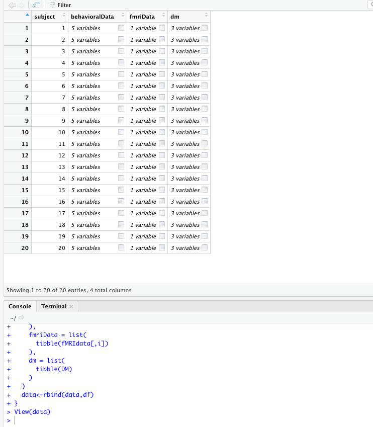
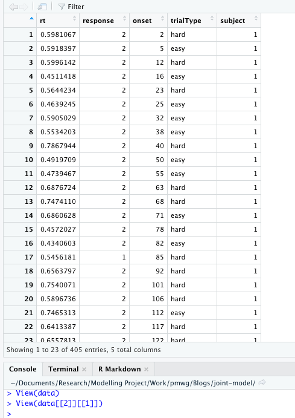

```{r setup, include=FALSE}
knitr::opts_chunk$set(echo = TRUE)
rm(list=ls())
setwd("~/Documents/Research/Modelling Project/Work/pmwg/Blogs/joint-model")
library(R.matlab)
library(tidyverse)
library(osfr)
library(httr)
library(pmwg)
library(rtdists)
library(fmri)
library(dplyr)
library(knitr)
```
# Joint Modelling 

Cognitive modelling has become ubiquitous within cognitive psychology, with greater computational resources and more efficient techniques enabling the uptake of modelling for a variety of tasks. This is exemplified in decision-making modelling literature, where models of decision-making have progressed rapidly since being first proposed. In recent years, such advances in modelling techniques has led to a new type of modelling technique; joint modelling.

Joint models come in several flavours, however, the main idea underpinning them is that they use data from multiple sources. This could be in the form of two behavioural tasks or neural data, which can help to better inform or constrain the model. PMwG is perfectly setup for joint modelling applications, due to the easily estimated covariance matrix which can act as a linking function, or can be used in covariate models. This blog post will show a three brief tutorials of how to conduct joint modelling exercises within PMwG, with a focus on data structure and writing the log-likelihood function. 


## Overview 

Joint modelling is viewed as a progressive step in cognitive modelling practice, as it allows us to model more of the psychological space and better inform our models. When combining data from multiple behavioural tasks, we can see how subject level parameters interact and differ between tasks. When combing neural data with behavioural data, we can see how covariates can inform our models of behaviour, or through modelling both data sources, we can investigate how model parameters correlate across the model space. This makes our models much stronger and allows us to answer new questions/ 

Often this kind of practice is difficult to do, especially with traditional model estimation methods such as DE-MCMC or HMC. These methods may require complex linking functions or weak post-hoc analysis of covariance. PMwG however makes this practice more efficient and easily implemented due to the particle metropolis algorithm used, as well as the covariance structure used to inform the multivariate normal underpinning the Gibbs step. 

As we mention earlier, there are several flavours of joint model, and these depend on the data and the models. First of all, if we have data from multiple behavioural tasks, we could use this to produce models for the different task components, with parameters for each component estimated together. We could also do model comparison exercises using parameters which were common to both components. Essentially, in this type of joint modelling, we can see what model parameters, and potentially processes, correlate across differing tasks (or environments). 

Secondly, joint models are commonly used to link neural observations to behaviour. This can be done through several methods, of which we'll outline two. The first method, which we'll call the covariate approach, involves linking specific parameters of the behavioural model to neural data (which is often weighted). This requires some theoretical underpinning, where a researcher might propose that measurements from a particular neural area may be driving a particular part of the model. The second approach, which we'll call the covariance approach, is similar to the joint behavioural modelling methods, where we join a model of behavioural data with a model of neural data. These neural models are common within the field and often easy to estimate, and so can easily fit within this framework. 

On this last point, it is important that with any models using PMwG that the likelihood is tractable and the density can be easily obtained (i.e. can be obtained through MCMC methods rather than approximate methods). It is also possible that with greater task numbers and data, that analysis may become unfeasible as the parameter space and processing time grows. It is worth first considering the research question and applying occhams razor to limit the hypothesis space.   


In the sections below, we outline methods for joint modelling in three separate applications - the covariance approach for two behavioural models, the covariate approach and then the covariance approach for behaviour and neural data. For simulation and recovery methods, see the former blog post on simulation and recovery methods. Using these methods, combined with data structures and likelihood functions below will allow for simulation and recovery of joint models. 

## Example 1 (behavioural)


The first example of joint modelling comes from a paper by Wall et al. (2020) - "Identifying Relationships Between Cognitive Processes Across Tasks, Contexts, and Time", with the data found on [osf](https://osf.io/rf8nd/). In this example, 20 participants completed a simple decision making task both in and out of a fMRI scanner. In this type of scenario, as the task was kept constant across environments (in or out of scanner), the authors expected parameters to remain constant. To test this, they modelled the data using the LBA for results from both environments. Typically, researchers would fit these models separately (using DE-MCMC), and then compare posterior estimates. Here, however, using PMwG, the authors were able to fit the two models simultaneously to constrain posterior samples and estimate a covariance matrix where the key interest point lies in the off-diagonal cells (i.e. correlations across environments). 


### Read in the data

Below provides code to read in the data from osf;

```{r getScanData, message=FALSE, warning=FALSE, eval=FALSE}
library(rtdists)
library(pmwg)
library(R.matlab)
library(dplyr)
url <- 'https://osf.io/r674t//?action=download'
filename <- 'LBA_Forstmann_scanner.mat'
GET(url, write_disk(filename, overwrite = TRUE))
data <- readMat(filename)
data <- data$data


tmp <- data.frame(matrix(ncol = 5, nrow = 0))
names <- c("response", "rt", "cond","scan", "subject")
colnames(tmp) <- names

for (i in 1:20){
  x<-as.data.frame(cbind(unlist(data[[1]][i]),unlist(data[[2]][i]),unlist(data[[3]][i]),unlist(data[[4]][i])))
  x$subject <- rep(i,nrow(x))
  names(x)<-names
  
  tmp<-bind_rows(tmp,x)
  
}
rownames(tmp)<-NULL
data <- tmp
data <- data[data$rt>.15,]

```


### The model

For the next step, we need to provide a log likelihood function. In this example, there is only one likelihood function we use (as we expect the model to be the same across environments), however, in further applications these models could be different. The key step comes in the linking likelihood function. For more information on writing your own likelihood functions, see [this documentation](https://newcastlecl.github.io/samplerDoc/) and the blog post on writing log likelihood functions. 

Below is code for the LBA model. The model is a simple LBA where only threshold varies across conditions; 

```{r scannerLBA, eval=FALSE}

lba_loglike <- function(x, data, sample = FALSE) {
  x <- exp(x)
  if (any(data$rt < x["t0"])) {
    return(-1e10)
  }
  if (sample){
    data$rt=NA
    data$resp = NA
  }
  
  bs <- x["A"] + x[c("b1", "b2", "b3")][data$cond]
  
  if (sample) {
    out <- rtdists::rLBA(n = nrow(data),
                         A = x["A"],
                         b = bs,
                         t0 = x["t0"],
                         mean_v = x[c("v1", "v2")],
                         sd_v = c(1, 1),
                         distribution = "norm",
                         silent = TRUE)
    data$rt <- out$rt
    data$response <- out$resp
    
  } else {
    out <- rtdists::dLBA(rt = data$rt,
                         response = data$response,
                         A = x["A"],
                         b = bs,
                         t0 = x["t0"],
                         mean_v = list(x["v1"],x[ "v2"]),
                         sd_v = c(1, 1),
                         distribution = "norm",
                         silent = TRUE)
    bad <- (out < 1e-10) | (!is.finite(out))
    out[bad] <- 1e-10
    out <- sum(log(out))
  }
  if (sample){return(data)}
  if (!sample){return(out)}
}


```


### Linking function

The below function is the linking function, which PMwG will use as the LL. In this function, it takes in the parameters and splits them for each component of the joint model. We then use `lba_loglike` created above to find the log likelihood of each set of parameters for the associated data. Following this, we sum these values (provided they are reasonable outputs). 

```{r scannerLinking, eval=FALSE}
ll=function(x,data,sample=FALSE){
  ### here i pull in the parameters for each component of the joint model and rename them for the LL. For safety, you could also do this by using grepl() and only taking those with certain values (i.e. "in.b1" or "out.b1"). 
  xIn<-x[1:7]
  xOut<-x[8:14]
  names(xIn)<-names(xOut)<- c("A","b1","b2","b3","v1","v2","t0")
  
  if (!sample){
    out.In = lba_loglike(xIn,data[data$scan==1,],sample=FALSE)
    out.Out = lba_loglike(xOut,data[data$scan==0,],sample=FALSE)
    
    ### check if either returned bad values (from bad parameters) and if so, return a bad outcome, otherwise, sum.
    if(out.In > -1e+10 && out.Out > -1e+10){
      #### this is the linking part. We can sum the two outcomes
      out <- sum(out.In,out.Out)
    }    else {
      out <- -1e10
    }
    return(out)
  }
  
  if (sample){
    ### as the data is structured similarly and our likleihood is setup to return the same structure with generated rt and resp, this part is simple. Other LLs may require further manipulation
    In <- lba_loglike(xIn,data[data$scan==1,],sample=TRUE)
    Out <- lba_loglike(xOut,data[data$scan==0,],sample=TRUE)
    data <- rbind(In, Out)
    return(data)
  }
}


```

### Run PMwG

Next we can run PMwG as per the code below. You'll notice that I have double the amount of parameters we may normally use (being "in" and "out" parameters). These parameters are used by the model ONLY for the associated environment (in or out of the scanner). 

```{r scannerPMwG, eval=FALSE}

# Specify the parameters and priors -------------------------------------------

# Vars used for controlling the run
pars <- c("in.b1", "in.b2", "in.b3", "in.A", "in.v1", "in.v2", "in.t0",
          "out.b1", "out.b2", "out.b3", "out.A", "out.v1", "out.v2", "out.t0")

priors <- list(
  theta_mu_mean = rep(0, length(pars)),
  theta_mu_var = diag(rep(1, length(pars)))) 


sampler <- pmwgs(
  data = data,
  pars = pars,
  prior = priors,
  ll_func = ll
)

sampler <- init(sampler)

sampled <- run_stage(sampler, stage = "burn",iter = 100, particles = 100, n_cores = 16)


sampled <- run_stage(sampled, stage = "adapt",iter = 10000, particles = 100, n_cores =16)


sampled <- run_stage(sampled, stage = "sample", iter = 1000, particles = 100, n_cores = 16)

save.image("bev.RData")

```

WARNING: this code will take some time to compute. For me, on 16 cores, it took ~1 hour on a high performance computing cluster with these settings.


### Output and outcomes

Once this has run, we can check our outputs. For this, we want to see what the posterior parameter estimates are (and how they differ between environments), as well as the correlations between parameters across environments. 

First we can look at parameters between environments;
```{r scannerOutcome, eval=TRUE, message=FALSE}
load("~/Documents/Research/Modelling Project/Work/pmwg/Blogs/joint-model/example1/bev.RData")

##first we look at median parameter estimates
tmp <- apply(sampled$samples$theta_mu[,sampled$samples$stage=="sample"],1,median)
inScan <- exp(tmp[1:7])
outScan <- exp(tmp[8:14])
tmp<-cbind(inScan,outScan)
rownames(tmp)<-c("b1","b2","b3","A","v1","v2","t0")
tmp
```


Then we look at the variance-covariance matrix. Here we transform the covariance matrix into a correlation matrix. 

```{r scanneroutcome2, eval=TRUE, message=FALSE}
library(lme4)
##this is the covariance structure
cov<-apply(sampled$samples$theta_sig[,,sampled$samples$idx-1000:sampled$samples$idx] ,1:2, mean)
colnames(cov)<-pars
rownames(cov)<-pars
cor<-cov2cor(cov) #transforms covariance to correlation matrix
cor

```


This is hard to tease apart, so let's visualize this;

```{r corVis, message=FALSE}

cov<-apply(sampled$samples$theta_sig[,,sampled$samples$idx-1000:sampled$samples$idx] ,1:2, mean)
colnames(cov)<-pars
rownames(cov)<-pars
cor<-cov2cor(cov) #transforms covariance to correlation matrix

library(corrplot)
corrplot(cor[1:7,8:14], method="circle")


```


Voila! A nice and neat joint model analysis. 
 
## Example 2 (neural covariate)

In this example, we'll step through the covariate method of joint modelling. This method uses secondary data sources to inform the model for the primary source of data. For example, a covariate could be measurements from EEG or measures from a personality questionnaire. In the current example, we use the former, where EEG estimates are directly input to inform the model. 

The data for this example come from a paper by  van Ravenzwaaij et al (2017) - ["A confirmatory approach for integrating neural and behavioral data into a single model"](https://www.sciencedirect.com/science/article/abs/pii/S0022249616300153), with the data being sourced from [osf](https://osf.io/2r7bv/). The experiment involved a mental rotation task where participants also underwent an EEG. In this example, we will make no scientific conclusions, and merely use this data for example purposes (as will be evident below). 


### Get the data

First we get the data (ensuring we have a subject column). The code below was adapted from the osf code (thanks to Don van Ravenzwaaij for including this in the osf). 

```{r rotationCov}
load ("~/Documents/Research/Modelling Project/Work/pmwg/Blogs/joint-model/example2/mentalRotation.RData")

#the code below comes from https://osf.io/2r7bv/
nPpn = length (unique (datErp[,11]))
nCon = 5
nStim = 2

Ppn = unique (datErp[,11])
datErp = datErp[datErp[,13]<7000,]
datErp[datErp[,12]>100,12] = datErp[datErp[,12]>100,12]-100

NeuroData = list ()
for (i in 1:nPpn){
  NeuroData[[i]] = list (RT = NULL, C = NULL, S = NULL, R = NULL, ERP = NULL, ERP23 = NULL, ERP34 = NULL, ERP45 = NULL, ERP56 = NULL, ERP67 = NULL, ERP78 = NULL, ERP89 = NULL, ERP90 = NULL)
  NeuroData[[i]]$RT = datErp[datErp[,11]==Ppn[i],13]/1000
  NeuroData[[i]]$C = (datErp[datErp[,11]==Ppn[i],12]-1)%%5+1										# 1 = 0, 2 = 45, 3 = 90, 4 = 135, 5 = 180
  NeuroData[[i]]$S = (datErp[datErp[,11]==Ppn[i],12]<21)+1										# 1 = same, 2 = mirror
  Correct = datErp[datErp[,11]==Ppn[i],14]														# 1 = correct, 0 = incorrect
  NeuroData[[i]]$R = (NeuroData[[i]]$S * Correct) + ((-NeuroData[[i]]$S + 3) * (-Correct + 1))	# 1 = same, 0 = mirror
  NeuroData[[i]]$ERP = apply (datErp[datErp[,11]==Ppn[i],3:10], 1, mean)							# ERP mean from 200 to 1000 ms
  for (j in 3:10) {NeuroData[[i]][[j+3]] = datErp[datErp[,11]==Ppn[i],j]}	# Individual ERP bins
  NeuroData[[i]]$S = factor (NeuroData[[i]]$S)
  NeuroData[[i]]$R = factor (NeuroData[[i]]$R)
  NeuroData[[i]]$C = factor (NeuroData[[i]]$C)
  NeuroData[[i]] = data.frame (NeuroData[[i]])
}
for (i in 1:nPpn){
  NeuroData[[i]]$subject <- rep(i,length(NeuroData[[i]]$RT))
}
tmp=do.call(rbind,NeuroData)


ERPavg <- tmp %>% group_by(subject, C, S) %>% summarise(erp89 = mean(ERP89),
                                                        erp90 = mean(ERP90)) %>% ungroup()

data<-left_join(tmp[,c(1:4,14)],ERPavg, by = c("subject", "C", "S"))
data$C<-as.character(data$C)
data$R<-as.character(data$R)
data$S<-as.character(data$S)
data <- data[data$RT<4,] #remove rts more than 4 seconds (for easier estimation)
```

### Likelihood (and Linking) function


For simplicity here, we use only the 2 ERP components (ERP89 and ERP90). These had the highest correlation with RT, so whilst these have no scientific relevance, it might make a nice analysis. Obviously this is terrible science, but here we're merely showing the process of coding a covariate model. So lets suppose that these two ERP components do actually have strong scientific links to the processes underpinning decision making. In the LBA, we may say that these components drive drift rate. We can implement this assumption to test it in the model. The model is below;


```{r rotationLBA}

ll=function(x,data,sample=FALSE){
  #i only exp 1-4 here as the two coefficients could be pos or neg
  x[1:4]=exp(x[1:4])
  if (any(data$RT < c(x["t0"]) )) {
    return(-1e10)
  }
  A=x["A"]
  t0=x["t0"]
  bs = x["b"]
  v1=v2=out=numeric(nrow(data))
  for (c in unique(data$C)){
    for (s in unique(data$S)){
      use = data$C == c & data$S == s
      v1[use]<- ifelse(s==1, x["v.mean"] + x["ERP89"]*data$erp89[use] + x["ERP90"]*data$erp90[use], 
                       x["v.mean"] - x["ERP89"]*data$erp89[use] - x["ERP90"]*data$erp90[use])
      v2[use]<- ifelse(s==2, x["v.mean"] + x["ERP89"]*data$erp89[use] + x["ERP90"]*data$erp90[use], 
                       x["v.mean"] - x["ERP89"]*data$erp89[use] - x["ERP90"]*data$erp90[use])
    }
  }

  if (sample){
    data$RT <- NA
    data$R <- NA
    for (i in 1:nrow(data)){
      tmp=rLBA(n=1,
               A=A,b=bs,t0=t0,mean_v=list(v1[i],v2[i]),sd_v=list(1,1),
               distribution = "norm", silent = TRUE)
      data$RT[i] <- tmp$rt
      data$R[i] <- tmp$resp
    }
    return(data)
  }else{
    out=dLBA(rt=data$RT,response = data$R,
             A=A,b=bs,t0=t0,mean_v=list(v1,v2),sd_v=list(1,1),
             distribution = "norm", silent = TRUE)
    
  }
  return(sum(log(pmax(out, 1e-10))))
}


```


In the model, our covariate part is input where we create our drift rate vectors. In this code block, there is a mean drift rate where we add or subtract (depending on the stimulus) the weighted ERP component. Here we weight the ERP component to protect against weird values and also to estimate the 'amount' of this measurement that informs drift. In this section, we add this to the corresponding accumulator (i.e. when stimulus is 1 then the accumulator for response 1 gets a boost whilst accumulator for response 2 is reduced). For this reason, we do not take the exponent of the coefficient values so that they can be estimated anywhere on the real line. In doing so, negative ERP components could become positive additions to the drift rate or vice-versa. For example if ERP89 was mainly negative values and this ERP component was responsible for faster drift rates, we would expect to see a larger negative number as this resulting value is ADDED to the corresponding drift rate, increasing drift and leading to faster RTs. Alternatively, if the values of ERP89 were mainly positive, yet this actually reduced drift rate, we would expect to see a negative coefficient.  

### Run in PMwG

Next we run PMwG;

```{r rotationPMwG, eval=FALSE}
pars <- c("A", "b","t0", "v.mean","ERP89","ERP90")      


priors <- list(
  theta_mu_mean = c(0,0,-2,1,-1,-1),
  theta_mu_var = diag(rep(1, length(pars)))) 


sampler <- pmwgs(
  data = data,
  pars = pars,
  prior = priors,
  ll_func = ll
)

sampler <- init(sampler)

sampled <- run_stage(sampler, stage = "burn",iter = 200, particles = 100, n_cores = 16)


sampled <- run_stage(sampled, stage = "adapt",iter = 10000, particles = 100, n_cores =16)


sampled <- run_stage(sampled, stage = "sample", iter = 1000, particles = 100, n_cores = 16)


```
WARNING: this code took roughly ~1 hour to run on a high performance computing cluster with these settings.


### Output
Now we can look at the output. Here our main variables of interest are the coefficient parameters for the ERPs effect on drift rate. Remember, as we did not transform (exp) these coefficients, we need to ensure that we don't transform them in post-processing either. 

```{r covOut, echo=FALSE}


load("~/Documents/Research/Modelling Project/Work/pmwg/Blogs/joint-model/example2/cov.RData")

```

```{r covout2}
##first we look at median parameter estimates
tmp <- apply(sampled$samples$theta_mu[,sampled$samples$stage=="sample"],1,median)
tmp[1:4]<-exp(tmp[1:4]) # only transform the main parameters to get them as values which the model would use
tmp
```

We can see here the weights of the coeffients. 

Then we look at variance-covariance matrix similar to above to see if there is anything interesting happening here;


```{r covout3}
library(lme4)
##this is the covariance structure
cov<-apply(sampled$samples$theta_sig[,,sampled$samples$idx-1000:sampled$samples$idx] ,1:2, mean)
colnames(cov)<-pars
rownames(cov)<-pars
cor<-cov2cor(cov) #transforms covariance to correlation matrix
cor


```

Finally, we can look at the posterior parameter estimates in reference to the prior, to see how much new information we've gathered with this fit. We can use these plots to see the spread of the posterior and whether the priors wash out with the posterior samples. 

```{r covout4}
pmwg_parHist <- function(samples, bins =30, prior = FALSE ){
  if (!prior){
    chains <- as.array(as_mcmc(samples))
    mcmc_hist(chains)
  } else{
    theta <- t(sampled$samples$theta_mu)
    theta<-as.data.frame(theta)
    long <- sum(sampled$samples$stage=="sample")
    theta <- theta[c((length(theta[,1])-long+1):length(theta[,1])),]
    theta <- pivot_longer(theta, cols = everything(), names_to = "pars", values_to = "estimate" )
    prior_mean <- sampled$prior$theta_mu_mean
    prior_var <- diag(sampled$prior$theta_mu_var)
    priors = NULL
    for (i in 1:sampled$n_pars){
      tmp <- rnorm(n=long, mean=prior_mean[i], sd=prior_var[i])
      tmp <- as.data.frame(tmp)      
      priors<-  c(priors, tmp[1:long,])
    }
    priors<-as.data.frame(priors)
    y <- as.factor(sampled$par_names)
    theta<-theta[order(factor(theta$pars, levels = y)),]
    theta$prior <- priors$priors
    theta$pars<- as.factor(theta$pars)
    
    
    ggplot(theta, aes(estimate))+
      geom_histogram(aes(y =..density..), bins = bins)+
      geom_density(aes(prior))+
      facet_wrap(~pars, scales = "free_y")+
      theme_bw()
  }
}


pmwg_parHist(sampled, prior=TRUE, bins=50)


```

Voila! A nice covariate joint model. Please use more science to inform parameters than we have in this example!

## Example 3 (neural joint model)


So far our data has been structured in such a way that makes it easy to split by subjects, but we run into problems when the data isn't perfectly rectangular. In this example, we'll go through ways of dealing with data sets of different shapes and fitting two different model components. Here, the models and data are highly simplified so that the focus is on ways to structure the data (not the methods used). 

In this example below, we fit very simple fMRI data and behavioural data. The fMRI data is generated using the fmri R package. The behavioural data is choice-RT data generated using a LBA model from rtdists. 

### Generate Data

In this example, for simplicity, we show synthetic data. First we generate the fmri data. This data gives a single measurement across 1500 experimental time points, with an easy and hard condition. The functions below are used to generate the task onsets, convolve the onsets with a HRF, generate the fMRI Bold signal and generate the behavioural data (also given the onsets). In this example, the data could relate to one brain region, where the data has been cleaned and convolved so that we now have a single vector of measurements across multiple time points which relate to easy and hard conditions. 

#### Functions for neural and behavioural data

Below are the functions (and packages) used to generate the data. First we generate onsets of the fMRI data. We then generate the design matrix, convolving the onsets with a HRF. We then use the onsets and design matrix to simulate fMRI data (given some parameters). For the behavioural data, we generate data for both the easy and hard conditions using the onsets from the fMRI data. 

```{r simFuncs}
library(rtdists)
library(fmri)
library(pmwg)
library(tibble)


generateOnsets <- function(scans=1500, TR=1.5, trialDuration=5, jitterOptions=c(0,1,2,3), addNullTrials=TRUE) {
  times <- seq(1, scans*TR, TR)
  trialDuration <- 5  # in seconds
  jitterOptions <- c(0, 1, 2, 3)
  trialOnsets <- seq(0, max(times), trialDuration)
  trialOnsets <- trialOnsets + sample(jitterOptions, length(trialOnsets), replace=TRUE)
  
  if(addNullTrials) {
    # 10% null trials, in an actual experiment you'd pseudo-randomize the null trial onsets to ensure they're not too predictable
    # but in this simulation it doesn't really matter so just remove every 10th onset
    trialOnsets <- trialOnsets[-seq(10, length(trialOnsets), 10)]
  }
  
  # half is easy, half is hard
  easyOnsets <- sort(sample(trialOnsets, size=length(trialOnsets)/2, replace=FALSE))
  hardOnsets <- setdiff(trialOnsets, easyOnsets)
  
  return(list('easy'=easyOnsets, 'hard'=hardOnsets))
}

generateDM <- function(onsets, TR, scans) {
  # convolve onsets with HRF - use 'fmri' package here, we're too lazy
  easy <- fmri.stimulus(scans=scans, onsets=onsets[['easy']]/TR, TR=TR)
  hard <- fmri.stimulus(scans=scans, onsets=onsets[['hard']]/TR, TR=TR)
  
  # design matrix - first column is intercept
  dm <- cbind(rep(1, length(easy)), easy, hard)
  
  return(dm)
}

# function to 'simulate' fmri data in single ROI
simulatefMRI <- function(beta0, beta1, beta2, dm, noisesd=0.02, plot=FALSE) {
  # The simulated data is a weighted sum of both event types, plus some noise (let's simplify and assume Gaussian noise [this is not the case in real data])
  # so we need parameters weighting the influence of both event types (easy and hard)
  simulatedData <- as.vector(c(beta0, beta1, beta2) %*% t(dm)) + rnorm(nrow(dm), 0, noisesd)
  
  if(plot) {
    par(mfrow=c(2,1))
    plot(dm[,2], type='l', col=1, xlab='Scan N', ylab='Expected signal (a.u.)', xlim=c(1,100))
    lines(dm[,3], col=2)
    legend('topleft', legend=c('Easy', 'Hard'), col=1:2, lty=c(1,1), bty='n')
    plot(simulatedData, type='l', col=1, xlab='Scan N', ylab='Expected signal (a.u.)', xlim=c(1,100), main='simulated signal')
    title(sub=paste(c('beta0', 'beta1', 'beta2'), round(c(beta0, beta1, beta2),2), sep = '=', collapse='  '))
  }
  return(simulatedData)
}

simulateBehavior <- function(b, vMean, vEasy, vHard, t0, onsets) {
  # use onsets to get number of easy and hard trials
  
  # easy <- rdiffusion(length(onsets$easy), v=vEasy, a=a, t0=t0)
  # hard <- rdiffusion(length(onsets$hard), v=vHard, a=a, t0=t0)
  easyDrift<-list(vMean-vEasy, vMean+vEasy)
  hardDrift<-list(vMean-vHard, vMean+vHard)
  
  easy <- rLBA(n = length(onsets$easy), mean_v = easyDrift, A = 1, b=b+1, t0=t0, sd_v = c(1,1))
  hard <- rLBA(n = length(onsets$hard), mean_v = hardDrift, A = 1, b=b+1, t0=t0, sd_v = c(1,1))
  
  easy$onset <- onsets$easy
  hard$onset <- onsets$hard
  easy$trialType <- 'easy'
  hard$trialType <- 'hard'
  
  simulatedData <- rbind(easy, hard)
  return(simulatedData[order(simulatedData$onset),])
}


```

#### Make the data

Now we run these functions with some input values to generate our two datasets. In this example, we use the drift rates to inform the beta parameters. Consequently, in recovery, we will look to see if these values are linked in the covariance matrix. This is slightly different to the full simulation and recovery (as seen in the simulation and recovery blog post), as we don't simulate the random effects from a MVNorm with a pre-set covariance matrix (which would be a more powerful method). Instead parameters are independent, apart from the drift rates and beta's. This just means we have less to compare against, but rather we are able to see how this kind of interaction would look in a covariance matrix.


In the code below, we generate some random effects which are all drawn from similar distributions (which does make the model slightly tricky to estimate). 

```{r makeWork, eval=F}

nSubs <- 20

# DDM parameters
b <- runif(n=nSubs, 1, 2.5)
vMean <- runif(n=nSubs, 2, 4)
vEasy <- runif(n=nSubs, 1,2.5)
vHard <- vEasy / runif(n=nSubs, 2, 3)
t0 <- runif(n=nSubs, 0.15, 0.3)

# fMRI parameters
beta0 <- runif(n=nSubs, 10, 30)  # intercept, not so interesting
# let's assume our BOLD responses are linearly dependent on drift rates, such that beta = w*v + some noise
w <- runif(n=nSubs, 0.4, 0.7)
beta1 <- vEasy*w + rnorm(nSubs, 0.05, 0.2)
beta2 <- vHard*w + rnorm(nSubs, 0.05, 0.2)
noisesd <- runif(nSubs, 0.05, 0.15)  # let's also estimate noise


# For each subject, generate a set of onsets, make the design matrix (dm), and then simulate both the fMRI and the behavioral data

fMRIdata=matrix(nrow=1500, ncol = nSubs)
behavioralData <- NULL

for (i in 1:nSubs){
  onsets <- generateOnsets(scans=1500, TR=1.5)
  dm <- generateDM(onsets, scans=1500, TR=1.5)
  fMRIdata[,i] <- simulatefMRI(beta0[i], beta1[i], beta2[i], noisesd[i], dm=dm, plot=FALSE)
  Data <- simulateBehavior(b[i], vMean[i], vEasy[i], vHard[i], t0[i], onsets)
  Data$subject <- i
  behavioralData <- rbind(behavioralData, Data) 
}

```


### Sturcture the data for PMwG

Next, we combine into one data object. This is the key step for this section of the tutorial. PMwG needs a single data object to be taken in. Usually, we would specify a list of lists for the data of two types, however, PMwG can't split this by subject. Instead, we make a tibble of tibbles. This big tibble includes a subject column meaning PMwG can easily split this for running the particle metropolis step on each subjects' data. 

Code shown below allows us to combine these data sets. Here, i include the behavioural data, the fmri data and the fmri design matrices (which are used in the likelihood for convolution). For this, we use a simple for loop which takes each subjects data from the three data frames and places it in the corresponding column and row of the data. 

```{r combineData, eval=F}

DM<-as.data.frame(dm)
data<-NULL
for (i in 1:nSubs){
  df <- tibble(
    subject = i,
    behavioralData = list(
      tibble(behavioralData[behavioralData$subject==i,])
    ),
    fmriData = list(
      tibble(fMRIdata[,i])
    ),
    dm = list(
      tibble(DM)
    )
  )
  data<-rbind(data,df)
}


```

The data then looks like this; 



In the example output above, the first column is the subject identifier, and the rest are columns of subjects data. If we open one cell, the output looks like this;


This means that if i split by subject (rows), the data in each row would relate to behavioural data for that subject for column 2, fmri for column 3 and design matrix for column 4. 

### The joint likelihood

The next key step is joint fitting of the data. Similar to the function used above, here we specify two separate log-likelihood functions (for behavioural data and fmri data) and a joint log-likelihood function which sums these. This is different to above, as we need to select the correct data input and input the correct parameters. Here we use log-likelihood functions that take atypical arguments to the normal function arguments, but this works fine in PMwG as the main log-likelihood function has the correct arguments `( x, data, sample=FALSE )`. 

In this example, the behavioural LL takes in the pre-transformed parameters and the data. We then get the cells in the data related to 'easy' or 'hard' trials, before making a list of the corresponding drift rates for these trials. Finally, we calculate the likelihood for the two conditions and sum these together (with some protection). Note: it is important that your likelihood function does not return any warning messages, as this can cause problems in the PMwG sampler. 

for the fMRI LL, we simply take in the transformed beta parameters and then convolve these with the design matrix. Next we use dnorm to calculate the density of these parameters given expected signal equation, with the sd set as the noise parameter. 

The joint model first trasnforms the parameters and then simply takes the output of both functions and returns the joint likelihood. Note the way that data is passed into each function so that it is structured in a likelihood function friendly fashion. 


```{r LLs, eval=F}


llBehavior <- function(A, b, vMean, vEasy, vHard, t0, behavioralData) {
  if (any(behavioralData$rt < t0 )) {
    return(-1e10)
  }
  idxEasy <- behavioralData$trialType=='easy'
  idxHard <- behavioralData$trialType=='hard'
  
  easyDrift<-list(vMean-vEasy, vMean+vEasy)
  hardDrift<-list(vMean-vHard, vMean+vHard)
  
  behavioralData$like[idxEasy] <- dLBA(rt=behavioralData$rt[idxEasy],resp=behavioralData$response[idxEasy], mean_v = easyDrift, A = A, b=b+A, t0=t0, sd_v = c(1,1), silent = TRUE)
  behavioralData$like[idxHard] <- dLBA(rt=behavioralData$rt[idxHard],resp=behavioralData$response[idxHard], mean_v = hardDrift, A = A, b=b+A, t0=t0, sd_v = c(1,1), silent = TRUE)
  
 
  out <- sum(log(pmax(behavioralData$like, 1e-10)))
  
  if (is.numeric(out)){
    return(out)
  }else{
    out <- -1e+10
    return(out)
  }
}

llfMRI <- function(beta0, beta1, beta2, noisesd, fMRIdata, dm) {
  
  expectedSignal <- as.vector(c(beta0, beta1, beta2) %*% t(dm))
  likes <- dnorm(unlist(fMRIdata)-expectedSignal, sd=noisesd)
  
  
  out <- sum(log(pmax(likes, 1e-10)))
  
  if (is.numeric(out)){
    return(out)
  }else{
    out <- -1e+10
    return(out)
  }
}

ll <- function(x,data,sample=FALSE){
  x[1:8]<- exp(x[1:8])
  out.behavior <- llBehavior(A=x["A"],b=x["b"], vMean=x["vMean"], vEasy = x["vEasy"], vHard = x["vHard"], t0 = x["t0"], behavioralData=as.data.frame(data$behavioralData))
  out.neural <- llfMRI(beta0 = x["beta0"], beta1 = x["beta1"], beta2 = x["beta2"], noisesd = x["noise"], fMRIdata = as.data.frame(data$fmriData), dm = as.data.frame(data$dm))
  
  if (!sample){
    if (is.numeric(out.behavior) && is.numeric(out.neural)){
      if(out.behavior > -1e+10 && out.neural > -1e+10){
        out <- sum(out.behavior,out.neural)
      } else {
      out <- -1e+10
      }
    }else {
      out <- -1e+10
    }
    return(out)
  }
}


```

### Run PMwG

Now we can run PMwG. This model was tricky to estimate (as estimates were quite similar between people), so we set adaptation to run for more particles, a longer time period and with a smaller epsilon. 

```{r runPMwG, eval=F}

pars <- c("A","b","vMean", "vEasy", "vHard", "t0", "beta0",  "noise", "beta1", "beta2")

priors <- list(
  theta_mu_mean = c(0,0,1,1,1,-3,3,0,0,0),
  theta_mu_var = diag(c(3,3,3,3,3,2,4,3,3,3))) 


sampler <- pmwgs(
  data = data,
  pars = pars,
  prior = priors,
  ll_func = ll
)

sampler <- init(sampler)


sampled <- run_stage(sampler, stage = "burn",iter = 100, particles = 100, n_cores = 16)


sampled <- run_stage(sampled, stage = "adapt",iter = 20000, particles = 500, n_cores = 16, epsilon=0.1)


sampled <- run_stage(sampled, stage = "sample", iter = 1000, particles = 100, n_cores = 16)


```

### Outputs

After this has run, we can check the outputs. Here we only show the posterior estimates against the prior to see if the priors wash out, and also show a correlation matrix, to see if drift is correlated with beta 1 and 2 (as we made them have some impact on one another). 

In further simulation and recovery exercises, we may generate our own covariance matrix and generate random effects from this as a more robust test of our likelihood function. Further, we may also wish to compare the recovery of mean group level generating parameter values, as shown in the simulation and recovery blog post. 

```{r fmriOutData, echo=FALSE}

load("~/Documents/Research/Modelling Project/Work/pmwg/Blogs/joint-model/example3/fmri.RData")

```


```{r fmriOut1, echo=FALSE}


pmwg_parHist <- function(samples, bins =30, prior = FALSE ){
  if (!prior){
    chains <- as.array(as_mcmc(samples))
    mcmc_hist(chains)
  } else{
    theta <- t(sampled$samples$theta_mu)
    theta<-as.data.frame(theta)
    long <- sum(sampled$samples$stage=="sample")
    theta <- theta[c((length(theta[,1])-long+1):length(theta[,1])),]
    theta <- pivot_longer(theta, cols = everything(), names_to = "pars", values_to = "estimate" )
    prior_mean <- sampled$prior$theta_mu_mean
    prior_var <- diag(sampled$prior$theta_mu_var)
    priors = NULL
    for (i in 1:sampled$n_pars){
      tmp <- rnorm(n=long, mean=prior_mean[i], sd=prior_var[i])
      tmp <- as.data.frame(tmp)      
      priors<-  c(priors, tmp[1:long,])
    }
    priors<-as.data.frame(priors)
    y <- as.factor(sampled$par_names)
    theta<-theta[order(factor(theta$pars, levels = y)),]
    theta$prior <- priors$priors
    theta$pars<- as.factor(theta$pars)
    
    
    ggplot(theta, aes(estimate))+
      geom_histogram(aes(y =..density..), bins = bins)+
      geom_density(aes(prior))+
      facet_wrap(~pars, scales = "free_y")+
      theme_bw()
  }
}


pmwg_parHist(sampled, prior=TRUE, bins=50)
```

```{r fmriOut2, echo=FALSE}

cov<-apply(sampled$samples$theta_sig[,,sampled$samples$idx-1000:sampled$samples$idx] ,1:2, mean)
colnames(cov)<-pars
rownames(cov)<-pars
cor<-cov2cor(cov) #transforms covariance to correlation matrix


library(corrplot)
corrplot(cor[1:6,7:10], method="number")


```


## Notes

I would like to thank Steven Miletic (University of Amsterdam) for creating the initial code used in example 3. Secondly, I would like to thank Niek Stevenson (University of Amsterdam) for sharing code to create figures. These functions and more can now be found at the [PMwG toolkit github](https://github.com/NewcastleCL/pmwg_toolkit) for user developed contributions. - Reilly


### References

Forstmann, B. U., Dutilh, G., Brown, S., Neumann, J., Von Cramon, D. Y., Ridderinkhof, K. R., & Wagenmakers, E. -J. (2008). Striatum and pre-SMA facilitate decision-making under time pressure. *Proceedings of the National Academy of Sciences, 105(45)*, 17538–17542.

Gunawan, D., Hawkins, G. E., Tran, M. N., Kohn, R., & Brown, S. D. (2020). New estimation approaches for the hierarchical Linear Ballistic Accumulator model. *Journal of Mathematical Psychology, 96*, 102368.

van Ravenzwaaij, D., Provost, A., & Brown, S. D. (2017). A confirmatory approach for integrating neural and behavioral data into a single model. *Journal of Mathematical Psychology, 76*, 131-141.

Wall, L., Gunawan, D., Brown, S. D., Tran, M. N., Kohn, R., & Hawkins, G. E. (2021). Identifying relationships between cognitive processes across tasks, contexts, and time. *Behavior Research Methods, 53(1)*, 78-95.


