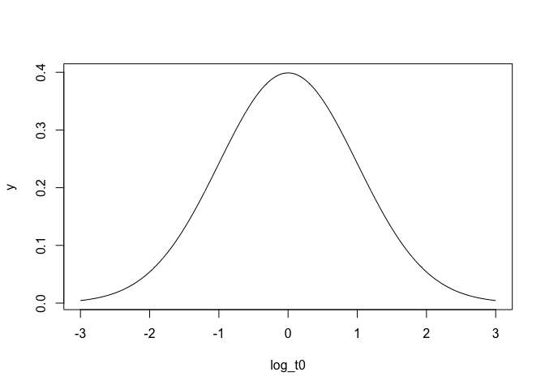
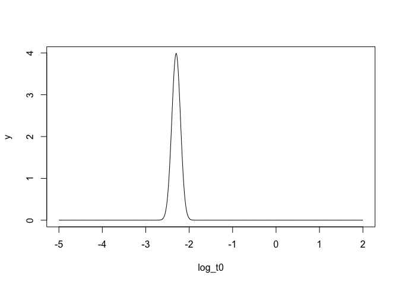
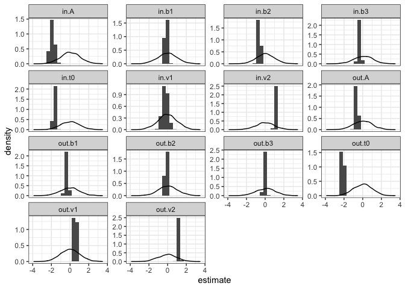
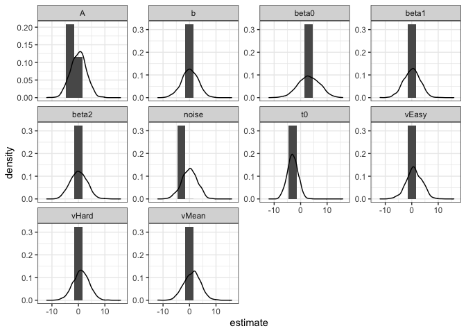

The Particle Metropolis within Gibbs (PMwG) sampling algorithm is a
Bayesian hierarchical sampler. Being Bayesian, we need to set priors,
which includes a prior on the sampling space. The PMwG algorithm works
using a Gibbs step on the group level parameter samples and a Particle
metropolis step at the individual subject level random effects. This
means that the group level distribution is sampled from a multivariate
normal distribution, and the group level comes from a conditional
multivariate normal, conditioned on a mix of the group distribution and
a gaussian around the current random effect.

For more information on priors of cognitive models, we recommend reading
(and working through) the Dynamic Models of Choice
[tutorial](https://osf.io/pbwx8/wiki/Introduction/) and
[paper](https://link.springer.com/article/10.3758/s13428-018-1067-y). We
recommend this reading as it highlights good priors practices and
outlines the key considerations when setting priors for your model. The
current blog post discusses applying these priors in the PMwG framework.

For the priors on the sampling space, the algorithm has a prior on the
multivariate normal, where the prior on the variance (sigma) is given by
Huang & Wand’s (2013) prior. In the PMwG sampling package we allow the
user to set values for the multivariate normal and this can be tricky.
This blog post outlines what the multivariate prior actually means, the
general values we use, how to set the values and parameter
transformations linked to the prior.

## The MVN prior

The multivariate normal as a prior is highly robust and flexible.
Remembering this is the prior on the sampling space, the multivariate
normal prior, for the kinds of hierarchical models you would typically
use PMwG for, captures variance of samples adequately. Many researchers
have asked whether the MVN works for parameters that generally follow
uniform or truncated distributions, but this can be handled by the PMwG
package - either by enough variance being captured at the group level or
through parameter transformations. We outline these in the next
sections.

## Setting PMwG Priors

From our sampler documentation, you’ll notice that in the past, we’ve
tended to set an uninformed prior of 0’s and 1’s. Later, we’ll show some
generic priors that are informed. But first lets go through what these
apply to.

The argument `prior` in the `sampler` function expects a list of priors
- including the prior values for the mean and variance, as shown in code
below;

``` r
priors <- list(
  theta_mu_mean = c(0,0,0,0,0),
  theta_mu_var = diag(c(1,1,1,1,1)))
```

Here, `theta_mu_mean` refers to the mean of the multivariate normal
values (for each parameter). In this example, all parameters have a
prior with gaussian centered at 0. The `theta_mu_var` argument takes in
the mean of the variance (for the covariance matrix of the MVN). Here,
the variance of the mean is set at 1, but you might want to change this
to make it far broader (say 9).

These values are able to manipulated as you like so that they apply to
your model. For example, if you had a model where a typcial prior for a
parameter was 10 and variance was 10, you would just change the
corresponding indexed values to 10 and 10 (in `theta_mu_mean` and
`theta_mu_var` respectively).

For an LBA model however, are these actually “good” prior values? The
answer is probably not. Take for instance the t0 parameter. In a data
set, we might restrict responses to be above 0.2s, meaning t0 really
shouldn’t be greater than this. However, a prior of 0 and variance 1
means on the log scale, our prior parameters would look something like
this;

<!-- -->

And this is way off what we might actually expect t0 to be (i.e exp of 2
= 7.4\!\!). Here we could give t0 a better value, so lets take the log
of what me might suppose is the center - 0.1 (-2.3). Netx we need to
propose some variance. This will probably be a skinnier distribution
than our other parameters, so lets make this 0.1. Now lets check how
this looks;

<!-- -->

This looks a lot better (although maybe we should increase the
variance). Now we have a prior for plausible t0 values.

## Plausible values

Above we showed the generic uninformed input values of 0’s and 1’s. But
lets move away from these, as we *can* inform our prior using prior
knowledge. Here we show some plausible LBA priors from Caroline Kuhne’s
PhD thesis work.

``` r
pars <- c("A", "b", "t0", "vc", "ve") #we set s to c(1,1) for scaling purposes

priors <- list(
  theta_mu_mean = c(0,0,-2,1,1), #A's and b's centred at about 1 (on the real line), t0 centred at about 0.1, v's centred at about 3-4. 
  theta_mu_var = diag(c(0.2,0.4,0.3,0.5,0.5))) # here the variance is much smaller to limit implausible values (i.e. very high t0, very low drift etc)
```

In this example, I’ve set the variance to be quite small. However, this
may not be advisable when the prior isn’t well informed. In most PMwG
fits we now do, it is more sensible to set the mean to a reasonable
value and then set greater variance, as shown below;

``` r
pars <- c("A", "b", "t0", "vc", "ve") #we set s to c(1,1) for scaling purposes

priors <- list(
  theta_mu_mean = c(0,0,-2,1,1), #A's and b's centred at about 1 (on the real line), t0 centred at about 0.1, v's centred at about 3-4. 
  theta_mu_var = diag(c(3,3,3,3,3))) # here the variance is larger, but may need to be increased further.
```

We recommend using either conservative uninformed priors (i.e. high
variance) or informed priors for fitting in PMwG. These may not have a
huge effect on the sampling process - maybe the prior will wash out,
maybe the values will sample at either end of the prior (i.e. the prior
limits the samples) - however, this does have major impacts when
estimating maximum likelihoods for model comparison.

Finally, it is important to consider what values the model will take in
and set priors accordingly. For example, in a regression model, our
intercept parameter may be \~40. Consequently, we need to update the
prior so that the prior is not centred at 0 with sd of 1. Rather it
might be set at 40, with sd of 10. This is entirely model dependent and
up to the researcher to set.

## Checking parameters aren’t restricted by the prior

One method of checking whether the prior is restricting the parameters
is to use the function below for all theta values. This code plots the
posterior samples as a histogram and overlays the prior density. From
this we can see: whether the estimates are falling within the prior
region; whether we need to increase the variance on the prior; and
whether the posterior is restricted by the prior (i.e. hitting the edge
of the prior).

The function for plotting and example code is shown below;

``` r
#requires 'bayesplot' package
pmwg_parHist <- function(samples, bins =30, prior = FALSE ){
  if (!prior){
    chains <- as.array(as_mcmc(samples))
    mcmc_hist(chains)
  } else{
    theta <- t(sampled$samples$theta_mu)
    theta<-as.data.frame(theta)
    long <- sum(sampled$samples$stage=="sample")
    theta <- theta[c((length(theta[,1])-long+1):length(theta[,1])),]
    theta <- pivot_longer(theta, cols = everything(), names_to = "pars", values_to = "estimate" )
    prior_mean <- sampled$prior$theta_mu_mean
    prior_var <- diag(sampled$prior$theta_mu_var)
    priors = NULL
    for (i in 1:sampled$n_pars){
      tmp <- rnorm(n=long, mean=prior_mean[i], sd=prior_var[i])
      tmp <- as.data.frame(tmp)      
      priors<-  c(priors, tmp[1:long,])
    }
    priors<-as.data.frame(priors)
    y <- as.factor(sampled$par_names)
    theta<-theta[order(factor(theta$pars, levels = y)),]
    theta$prior <- priors$priors
    theta$pars<- as.factor(theta$pars)
    
    
    ggplot(theta, aes(estimate))+
      geom_histogram(aes(y =..density..), bins = bins)+
      geom_density(aes(prior))+
      facet_wrap(~pars, scales = "free_y")+
      theme_bw()
  }
}


pmwg_parHist(sampled, bins=20, prior=TRUE)
```

<!-- -->

Here we see the posterior distributions (bars) with the prior overlaid
(line). This depiction can help us see whether our priors are wide
enough. For example, both t0 estimates are hitting against the side of
the prior, meaning the prior may be restricting them and needs to be
wider or shifted. From these figures we can also see how much we learn
about the posterior estimates of parameters in relation to the prior.

## Transformations on parameters

In many of the models we use, we may have to perform parameter
transformations in the likelihood function. For example, when using the
LBA, all parameters must be positive, so we exponentially transform all
input parameters (making them all positive). This means that a value of
0 (the mean of the prior) becomes 1.

It is essential to consider parameter transformations when inputting
values in the prior. In the LBA, the real prior values we would use are
centered around 1 and truncated at 0. This means the prior we input is
the opposite of the transform (the log) of these values (hence a prior
of 1 becomes 0). Secondly, this also applies to the variance. In the
example above, if the variance is 1, you could get values of -1 or 1.
However, we take the exponential of these which actually gives 0.37 or
2.72, and hence the variance is skewed. This may not change the input
values, but needs to be considered (for all types of parameter
transformations) for both the mean and the variance.

In the example below, we can see some different prior mean and variance
settings. In this example, the first 8 parameters are logged (so we take
the exponent of this in the model). For these 8 parameters, consider
what the exponent of the values in the tails would equate to.

``` r
load("~/Documents/Research/Modelling Project/Work/pmwg/Blogs/joint-model/example3/fmri.RData")

sampled$prior$theta_mu_mean
```

    ##  [1]  0  0  1  1  1 -3  3  0  0  0

``` r
diag(sampled$prior$theta_mu_var)
```

    ##  [1] 3 3 3 3 3 2 4 3 3 3

``` r
pmwg_parHist(sampled, bins=10, prior = T)
```

<!-- -->

## Other distributions?

A common question we find for people new to PMwG sampling is priors for
alternative distributions (e.g. uniform distributions). This happens for
models where the prior states that the probability of parameters values
in a range is, for example, completely uniform or uses a spike and slab
prior. Whilst we understand why this might be applicable for some
modelling techniques, PMwG handles this with the sophisticated prior on
the sampling space. Here, the researcher only needs to specify the
center of the prior distribution and a variance that is wide enough to
capture all plausible values - similar to how other priors are used. The
density however, should not negatively impact the sampling algorithm.
Whilst values closer to the center will be more likely under the prior,
the posterior estimates will only be restricted by the variance (and
therefore range) specified by the researcher. In short, don’t stress -
the multivariate normal distribution will work just fine\!
