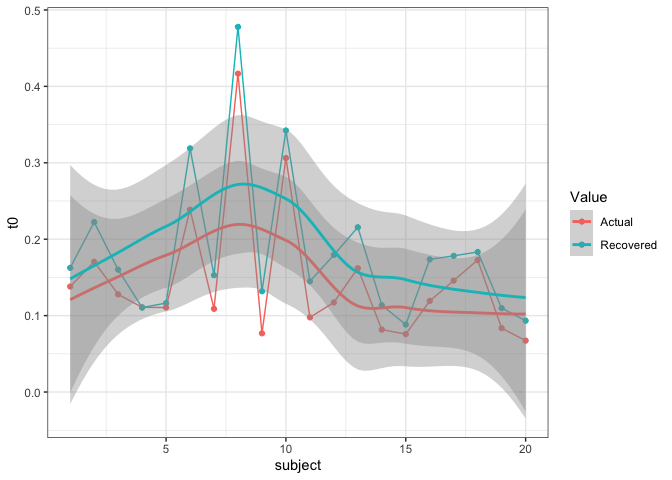
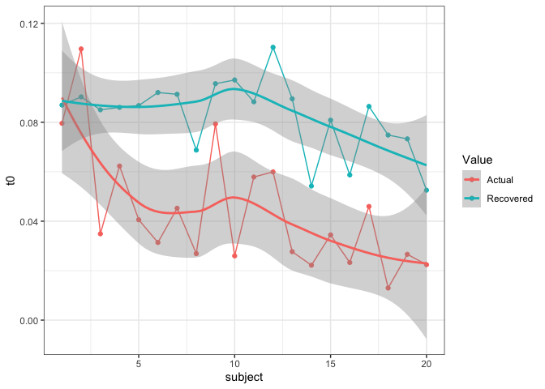

# Good Question

There has been substantial research and debate over the non-decision
time parameter of evidence accumulation models. For LBA and diffusion
models, there is often a discrepancy, where diffusion models show longer
t0 times, with the LBA known to poorly estimate this parameter.
Researchers are aware of this, however, the issue is largely ignored.
Research into this parameter has used neural measurement data and
muscular activity to provide useful estimates of t0 - i.e. the upper and
lower limits of the parameter, to give a sense of how accurate this
estimation is.

Recently, following a paper by Gunawan et al., (2020), a new method of
bayesian hierarchical estimation was provided which showed more reliable
parameter estimation. Following several modelling exercises using this
method (known as Particle Metropolis within Gibbs - PMwG), it was found
that t0 estimates were much improved from previous DE-MCMC sampling
methods. “Much improved” being that estimates of t0 often centered
around 0.01 seconds, whereas in PMwG, this was closer to 0.1 seconds -
much more reasonable. So maybe it wasn’t so much a problem with the
model, but rather a problem with the model estimation. In this blog
post, i explore why this might be.

## First, parameter recovery

First of all, I’ll make sure this holds in a parameter recovery exercise
- after all, we would like to know if the LBA is still doing a
not-so-great job of figuring out t0. In this simulation exercise, I show
t0 recovering at 3 different values for a single t0 LBA model (i.e. one
t0 for all simulated conditions) and 3 lots of t0 values for a three t0
model (i.e. each condition has a t0 value). In the code, i only show
simulation and recovery methods for one of these, however, the
methodology was consistent across values.

### Single t0

|           |        t0 |
| --------- | --------: |
| Actual.t0 | 0.2000000 |
| Recovered | 0.2254268 |

Large t0

|           |        t0 |
| --------- | --------: |
| Actual.t0 | 0.1000000 |
| Recovered | 0.1715356 |

Medium t0

|           |        t0 |
| --------- | --------: |
| Actual.t0 | 0.0300000 |
| Recovered | 0.0836326 |

Small t0

#### Large

<!-- -->

#### Medium

<!-- -->

<!-- -->

### Multiple t0

|               |        t0 |
| ------------- | --------: |
| Actual.t01    | 0.1500000 |
| Actual.t02    | 0.2000000 |
| Actual.t03    | 0.2500000 |
| Recovered.t01 | 0.1227897 |
| Recovered.t02 | 0.1991755 |
| Recovered.t03 | 0.1987277 |

Large t0

|               |        t0 |
| ------------- | --------: |
| Actual.t01    | 0.0500000 |
| Actual.t02    | 0.1000000 |
| Actual.t03    | 0.1500000 |
| Recovered.t01 | 0.0733236 |
| Recovered.t02 | 0.1138871 |
| Recovered.t03 | 0.1758666 |

Medium t0

|               |        t0 |
| ------------- | --------: |
| Actual.t01    | 0.0300000 |
| Actual.t02    | 0.0600000 |
| Actual.t03    | 0.0900000 |
| Recovered.t01 | 0.0507706 |
| Recovered.t02 | 0.0972373 |
| Recovered.t03 | 0.1111606 |

Small t0

So, it looks like t0 recovers relatively well, but maybe not all the way
(especially with larger values). This means that the LBA may still not
perfectly estimate actual t0 values, but could also come from the
variance in the individual subject synthetic parameters. One thing is
for sure though, t0 is recovered at reasonable values compared to old
DE-MCMC. So what could help this estimation method?

WHY?????? espeically for small values, it actually is bigger???? Check
other params

## log transform

One answer to this question is the log transformation of the parameter
vector. This was proposed in Gunawan et al., (2020) so that values drawn
from PMwG, which are on the real number line, could be used with the LBA
- which requires positive-definite values. Hence, when using the LBA in
PMwG, we take the exponent of the proposal parameters to calculate the
likelihood - where we return the log of the likelihood.

explain why this would change it.

To test this, I use the forstmann (2008) dataset reported in Gunawan et
al., (2020) for a 3 threshold LBA. Using the PMwG sampler, i fit the
model twice, using varying likelihood functions - one which takes the
exponent of the proposed values and one which returns bad likelihoods
for proposed values below 0.

The results are shown below.

|             |        t0 |
| ----------- | --------: |
| Exponential | 0.1207189 |
| Log Scale   | 0.1004302 |

t0 estimated values on the exponential scale (normal way) and on the
real number line (logged)

### alpha values

<!-- -->

WHY DOES THIS HAPPEN??????

## covariance matrix

|                             |        t0 |
| --------------------------- | --------: |
| Exponential with Covariance | 0.1207189 |
| Without Covariance          | 0.1058109 |

t0 estimated with and without the covariance structure (using a high
v-half)

### alpha values

<!-- -->

## a comment on hierarchical shrinkage

Evidently, although the sampler does a good job in recovering most
values of t0, we still see some hierarchical shrinkage, especially with
larger t0 values. This is to be expected with hierarchical bayesian
sampling models, however, should still be considered when reporting
results.
