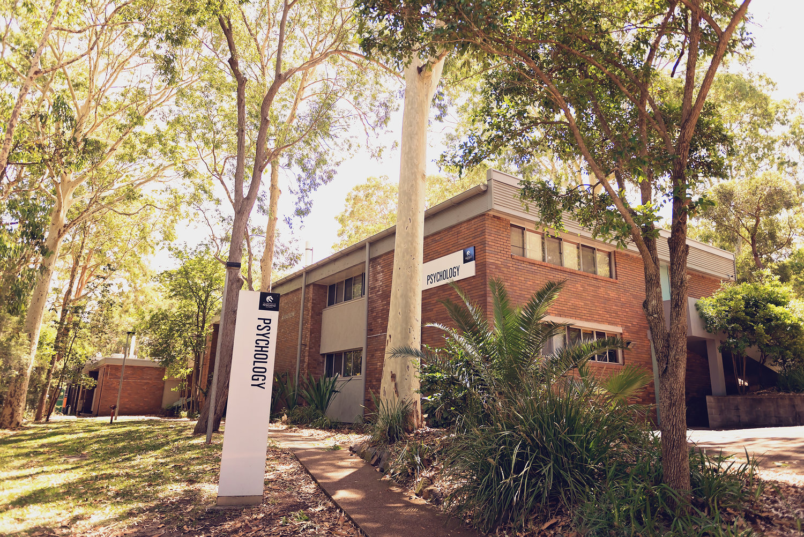

# Newcastle Cognition Lab

Newcastle Cognition Lab is the home of Cognitive Psychology research at The University of Newcastle, Australia. We are one of the top three cognitive research laboratories in Australia, and are advocates of Bayesian methodologies as well as open science. Our research includes consumer choice, behavioural modelling, cognitive workload, perception and memory. 

The research conducted by our lab is supported by the Australian Research Council (ARC), the National Health and Medical Research Council (NHMRC), the New South Wales Ministry of Health and the Centre for Brain and Medical Health Research (CBMHR). We have also worked with the aviation industry and local government.
